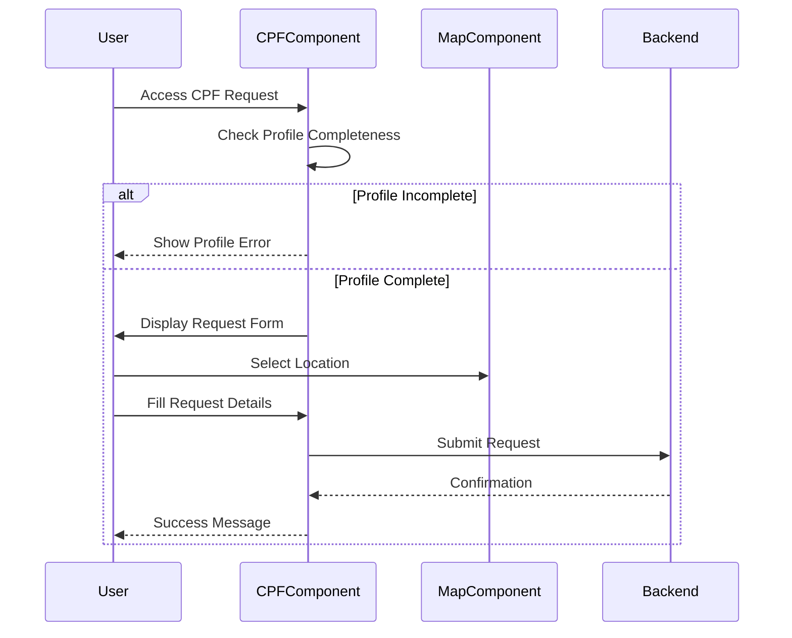
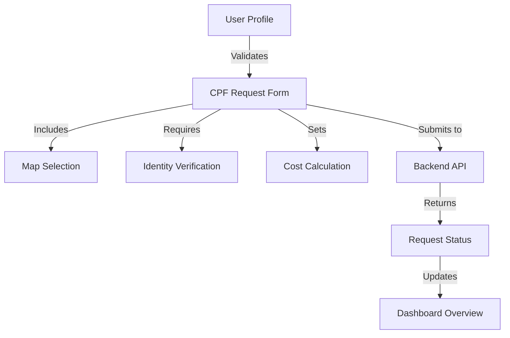

# Authentication and Dashboard Flow

[Previous sections remain unchanged...]

## 7. CPF Request System

### Request Flow



### Prerequisites

1. Complete User Profile
   - Identity Number
   - Birth Date
   - Address
   - Other required information

### Request Process

1. Profile Validation

   ```typescript
   if (!identityNumber || !birthDate || !address) {
     profileComplete = false;
     profileError = "Please complete your profile...";
   }
   ```

2. Form Data

   - Identity Number
   - Address (with Map Integration)
   - Birth Date
   - Cost (Fixed at 7.09 BRL)
   - Initial Status: 'pending'

3. Request Submission
   ```typescript
   POST /api/cpf-requests
   Headers: {
     'Content-Type': 'application/json',
     'Authorization': 'Bearer <token>'
   }
   Body: {
     identityNumber: number,
     address: string,
     birthDate: string,
     cost: string,
     status: string
   }
   ```

### Status Tracking

1. Pending
2. In Review
3. Approved
4. Rejected

### Security Measures

- JWT Authentication Required
- Profile Completeness Validation
- Data Validation
- Secure HTTP Headers

### Map Integration

- Interactive location selection
- Address verification
- Coordinate tracking

### Error Handling

1. Profile Validation Errors

   - Incomplete profile detection
   - Missing required fields

2. Submission Errors

   - Network errors
   - Validation errors
   - Server errors

3. User Feedback
   - Success messages
   - Error notifications
   - Status updates

### Data Flow



### Integration Points

1. Profile Service

   - User data retrieval
   - Profile completeness check

2. Map Service

   - Location selection
   - Address validation

3. Backend API

   - Request submission
   - Status updates
   - Cost calculation

4. Dashboard Integration
   - Request tracking
   - Status updates
   - Notification system

### User Experience Considerations

1. Form Validation

   - Real-time validation
   - Clear error messages
   - Required field indicators

2. Map Interaction

   - Easy location selection
   - Address confirmation
   - Visual feedback

3. Status Updates

   - Clear status indicators
   - Progress tracking
   - Email notifications

4. Cost Transparency
   - Fixed cost display
   - Payment information
   - Receipt generation

### Technical Implementation

1. Component Structure

   ```typescript
   @Component({
     selector: 'app-cpf-request',
     imports: [
       CommonModule,
       FormsModule,
       RouterModule,
       MapsComponent
     ]
   })
   ```

2. Data Management

   - Form state handling
   - Map data integration
   - API communication

3. Security

   - Token validation
   - Data encryption
   - Error handling

4. Performance
   - Lazy loading
   - Optimized API calls
   - Efficient data storage
