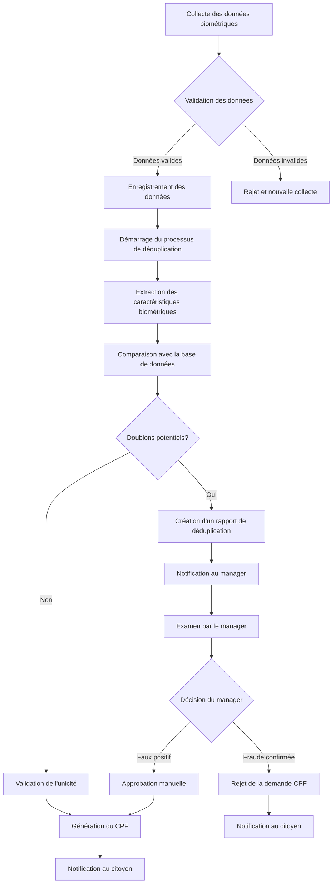

# Processus de Déduplication Biométrique

## 1. Vue d'ensemble

Le processus de déduplication biométrique est une fonctionnalité essentielle du système Identity Secure qui permet d'identifier les doublons potentiels dans les données biométriques des citoyens. Ce processus est crucial pour maintenir l'intégrité du système CPF brésilien en empêchant qu'une même personne obtienne plusieurs identifiants.

## 2. Objectifs

- Détecter les tentatives de fraude d'identité
- Empêcher la création de multiples CPF pour une même personne
- Assurer l'unicité des identifiants biométriques dans le système
- Fournir un mécanisme de vérification pour les officiers et managers
- Automatiser le processus de détection des doublons

## 3. Flux de travail



## 4. Composants du système

### 4.1 Module de collecte biométrique

- Capture des empreintes digitales (10 doigts)
- Capture de l'image faciale
- Capture des iris (optionnel)
- Validation de la qualité des données biométriques

### 4.2 Module d'extraction des caractéristiques

- Extraction des minuties des empreintes digitales
- Extraction des caractéristiques faciales
- Extraction des caractéristiques de l'iris
- Génération de templates biométriques

### 4.3 Module de comparaison

- Comparaison 1:N (une personne contre toute la base)
- Calcul des scores de similarité
- Détermination des seuils de décision
- Gestion des faux positifs et faux négatifs

### 4.4 Module de gestion des doublons

- Création de rapports de déduplication
- Interface de vérification pour les managers
- Système de décision (confirmation/rejet)
- Historique des cas de déduplication

## 5. Modèles de données

### 5.1 BiometricData

```javascript
const biometricSchema = new mongoose.Schema({
  userId: {
    type: mongoose.Schema.Types.ObjectId,
    ref: "User",
    required: true
  },
  
  // Données du visage
  face: {
    data: Buffer,
    contentType: String,
    quality: Number,
    template: Buffer,
    uploadedAt: Date
  },
  
  // Données des empreintes digitales
  fingerprints: [{
    finger: {
      type: String,
      enum: ['thumb_right', 'index_right', 'middle_right', 'ring_right', 'little_right',
             'thumb_left', 'index_left', 'middle_left', 'ring_left', 'little_left']
    },
    data: Buffer,
    contentType: String,
    quality: Number,
    template: Buffer,
    uploadedAt: Date
  }],
  
  // Données des iris
  iris: {
    left: {
      data: Buffer,
      contentType: String,
      quality: Number,
      template: Buffer,
      uploadedAt: Date
    },
    right: {
      data: Buffer,
      contentType: String,
      quality: Number,
      template: Buffer,
      uploadedAt: Date
    }
  },
  
  // Métadonnées de collecte
  collectedBy: {
    type: mongoose.Schema.Types.ObjectId,
    ref: 'User' // Référence à l'officier qui a collecté les données
  },
  collectedAt: {
    type: Date,
    default: Date.now
  },
  
  // Statut de déduplication
  deduplicationStatus: {
    type: String,
    enum: ['not_started', 'in_progress', 'no_match', 'potential_match', 'confirmed_match'],
    default: 'not_started'
  }
}, {
  timestamps: true
});
```

### 5.2 DeduplicationRecord

```javascript
const deduplicationRecordSchema = new mongoose.Schema({
  // Identifiants
  originalUserId: {
    type: mongoose.Schema.Types.ObjectId,
    ref: "User",
    required: true
  },
  matchedUserId: {
    type: mongoose.Schema.Types.ObjectId,
    ref: "User",
    required: true
  },
  
  // Scores de similarité
  faceMatchScore: {
    type: Number,
    min: 0,
    max: 100
  },
  fingerprintMatchScores: [{
    finger: String,
    score: Number
  }],
  irisMatchScores: {
    left: Number,
    right: Number
  },
  
  // Statut et décision
  status: {
    type: String,
    enum: ['pending', 'confirmed', 'rejected'],
    default: 'pending'
  },
  
  // Métadonnées
  detectedAt: {
    type: Date,
    default: Date.now
  },
  decidedBy: {
    type: mongoose.Schema.Types.ObjectId,
    ref: 'User' // Référence au manager qui a pris la décision
  },
  decidedAt: Date,
  notes: String
}, {
  timestamps: true
});
```

## 6. API de déduplication

### 6.1 Démarrer le processus de déduplication

```
POST /api/biometric/deduplication/start
```

Démarre le processus de déduplication pour un utilisateur spécifique.

**Corps de la requête:**
```json
{
  "userId": "60d21b4667d0d8992e610c85"
}
```

**Réponse réussie (200 OK):**
```json
{
  "success": true,
  "message": "Deduplication process started",
  "processId": "60d21b4667d0d8992e610c90"
}
```

### 6.2 Obtenir le statut de déduplication

```
GET /api/biometric/deduplication/status/:userId
```

Récupère le statut du processus de déduplication pour un utilisateur.

**Réponse réussie (200 OK):**
```json
{
  "status": "in_progress",
  "progress": 45,
  "startedAt": "2023-06-15T10:30:00Z"
}
```

### 6.3 Obtenir les résultats de déduplication

```
GET /api/biometric/deduplication/results/:userId
```

Récupère les résultats de déduplication pour un utilisateur.

**Réponse réussie (200 OK):**
```json
{
  "status": "potential_match",
  "matches": [
    {
      "userId": "60d21b4667d0d8992e610c86",
      "faceMatchScore": 85.7,
      "fingerprintMatchScores": [
        { "finger": "index_right", "score": 92.3 },
        { "finger": "thumb_right", "score": 88.1 }
      ],
      "overallScore": 89.4
    }
  ]
}
```

### 6.4 Confirmer/Rejeter un doublon

```
POST /api/biometric/deduplication/decision/:recordId
```

Permet à un manager de confirmer ou rejeter un doublon potentiel.

**Corps de la requête:**
```json
{
  "decision": "confirmed",
  "notes": "Tentative évidente de fraude d'identité"
}
```

**Réponse réussie (200 OK):**
```json
{
  "success": true,
  "message": "Decision recorded successfully"
}
```

## 7. Seuils de décision

Le système utilise les seuils suivants pour déterminer les doublons potentiels:

| Type biométrique | Seuil de correspondance |
|------------------|-------------------------|
| Visage           | ≥ 75%                   |
| Empreinte digitale | ≥ 80%                 |
| Iris             | ≥ 85%                   |

Une correspondance est considérée comme un doublon potentiel si:
- Le score du visage est supérieur ou égal à 75%, OU
- Au moins deux empreintes digitales ont un score supérieur ou égal à 80%, OU
- Au moins un iris a un score supérieur ou égal à 85%

## 8. Interface utilisateur

### 8.1 Interface de l'officier

- Écran de collecte des données biométriques
- Visualisation de la qualité des données collectées
- Démarrage du processus de déduplication
- Notification des résultats

### 8.2 Interface du manager

- Tableau de bord des cas de déduplication en attente
- Interface de comparaison visuelle des données biométriques
- Formulaire de décision (confirmer/rejeter)
- Historique des décisions prises

## 9. Considérations de sécurité

- Toutes les données biométriques sont chiffrées au repos
- Les templates biométriques sont stockés séparément des données brutes
- L'accès aux données biométriques est strictement contrôlé
- Toutes les actions de déduplication sont journalisées pour audit
- Les décisions de déduplication nécessitent une authentification à deux facteurs
