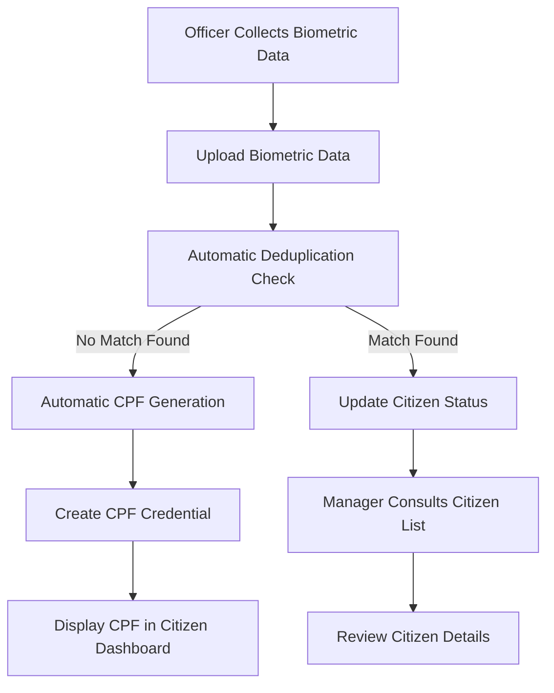

# CPF Biometric Workflow Implementation Plan

## Overview

This document outlines the implementation plan for the automated biometric data collection, deduplication, and CPF generation workflow for the "Gérer CPF" sprint (Sprint 3). The process begins when an officer collects biometric data during an appointment and ends with the citizen receiving their CPF credential.

This implementation addresses the following key functional requirements:

- Citizens can view their CPF, request blocking, and receive transaction notifications
- Officers can upload biometric data (fingerprints, face images, iris scans)
- System automatically executes deduplication processes on biometric data
- Managers and officers can consult citizen lists with various status filters
- Citizens can download their CPF credentials securely

## Workflow Stages



## Detailed Implementation Plan

### 1. Biometric Data Collection & Upload

#### Officer Interface Enhancements

- Add biometric capture functionality to the appointment completion screen
- Implement capture interfaces for:
  - Facial image (front-facing, neutral expression)
  - Fingerprints (all 10 fingers)
  - Iris scans (both eyes)
- Add quality validation for captured biometrics
- Implement secure upload to server

#### Backend Implementation

- Enhance the existing biometric controller to:
  - Process multiple biometric files
  - Validate file quality and format
  - Store files securely with encryption
  - Link biometrics to user's CPF request and appointment

#### Data Model Updates

- Update the Biometric model to include verification status
- Add quality metrics for each biometric type
- Add timestamp for collection

### 2. Automatic Deduplication Process

#### Deduplication Service

- Implement a service that automatically triggers when biometric data is uploaded
- Create integration with external deduplication API
- Implement secure data transmission protocol
- Process and store deduplication results

#### Deduplication API Integration

- Implement authentication with external API
- Create data formatters for API compatibility
- Implement endpoints for:
  - Face matching
  - Fingerprint matching
  - Iris matching
  - Combined multimodal matching
- Implement response handlers and error management

#### Results Processing

- Create a scoring system for match confidence
- Implement threshold-based decision making
- Store detailed match results for audit purposes

### 3. Automatic CPF Generation

#### CPF Generator Service

- Enhance the existing CPF generator to run automatically after successful deduplication
- Implement the Brazilian CPF algorithm with verification digits
- Ensure uniqueness of generated CPF numbers
- Add validation against blacklisted numbers

#### CPF Credential Creation

- Create a service to automatically generate CPF credentials
- Include user information, biometric verification status
- Set expiration date (10 years from issuance)
- Generate secure credential identifier

### 4. Blacklist Management

#### Blacklist Service

- Create a new collection for blacklisted biometrics
- Implement storage of matched biometrics with confidence scores
- Store reference to original and matching records
- Add timestamp and status fields

#### Blacklist Data Model

```javascript
{
  originalUserId: ObjectId,
  matchedUserId: ObjectId,
  matchConfidence: {
    face: Number,
    fingerprints: Number,
    iris: Number,
    overall: Number
  },
  biometricType: ["face", "fingerprint", "iris"],
  status: "pending", "confirmed", "dismissed",
  createdAt: Date,
  reviewedAt: Date,
  reviewedBy: ObjectId
}
```

### 5. Citizen Dashboard Updates

#### CPF Credential Display

- Add a new section to the citizen dashboard for CPF credentials
- Display CPF number, issuance date, and expiration date
- Add download functionality for CPF certificate
- Implement transaction history view

#### Notification System

- Create notifications for CPF issuance
- Add real-time status updates during the process
- Implement email notifications for important status changes

### 6. Citizen List Management Interface

#### Citizen List Dashboard

- Create a unified dashboard for viewing all citizens
- Implement filtering by status (active, suspended, blocked)
- Add filtering by CPF generation state (pending, generated, rejected)
- Implement pagination and sorting functionality

#### Citizen Detail View

- Add detailed view of citizen information
- Display biometric verification status
- Show CPF generation history
- Include transaction history and status changes

## Technical Implementation Details

### Backend Components

#### New Controllers

1. **DeduplicationController**

   - `triggerDeduplication(biometricId)` - Automatically triggered after biometric upload
   - `getDeduplicationResults(biometricId)` - Get results of deduplication
   - `getBlacklistedUsers()` - Get list of blacklisted users

2. **BlacklistController**

   - `addToBlacklist(userId, matchData)` - Add user to blacklist
   - `reviewBlacklistEntry(entryId, decision)` - Review and update blacklist entry
   - `getBlacklistEntries(filters)` - Get filtered blacklist entries

3. **AutomatedCpfController**
   - `generateCpf(userId)` - Automatically generate CPF for verified user
   - `issueCpfCredential(userId, cpfNumber)` - Create and issue CPF credential

#### New Models

1. **DeduplicationResult**

```javascript
{
  biometricId: ObjectId,
  userId: ObjectId,
  results: {
    faceMatches: [{ userId, confidence, imageUrl }],
    fingerprintMatches: [{ userId, fingerIndex, confidence }],
    irisMatches: [{ userId, eyeSide, confidence }]
  },
  overallResult: "clear", "potential_match", "confirmed_match",
  processedAt: Date
}
```

2. **Blacklist**

```javascript
{
  userId: ObjectId,
  biometricId: ObjectId,
  matchedWith: [{
    userId: ObjectId,
    biometricId: ObjectId,
    confidence: Number,
    matchType: ["face", "fingerprint", "iris"]
  }],
  status: "pending", "confirmed", "dismissed",
  createdAt: Date,
  reviewedAt: Date,
  reviewedBy: ObjectId
}
```

### Frontend Components

#### Officer Interface

- Biometric capture component with camera and scanner integration
- Quality validation indicators
- Upload progress and status display

#### Citizen Dashboard

- CPF credential display component
- Transaction history component
- Notification center

#### Manager Dashboard

- Fraud case list component
- Biometric comparison tool
- Case management interface

## Sprint 3 Backlog Implementation

Based on the Sprint 3 backlog "Gérer CPF", the following tasks will be implemented:

### User Story: Manager CPF Consultation and Citizen List Management

| ID  | Task                                                                            | Duration |
| --- | ------------------------------------------------------------------------------- | -------- |
| 4.1 | Implement frontend interface to display citizen CPF with pagination and filters | 1 day    |
| 4.2 | Develop backend API to retrieve CPF data                                        | 1 day    |
| 4.3 | Add role-based access control for authorized officers                           | 1 day    |

### User Story: Citizen CPF Consultation and Biometric Data Management

| ID  | Task                                                                                     | Duration |
| --- | ---------------------------------------------------------------------------------------- | -------- |
| 4.1 | Implement frontend interface for secure biometric data upload (visage, empreintes, iris) | 1 day    |
| 4.2 | Develop backend API to receive and store biometric data                                  | 1 day    |
| 4.3 | Integrate automatic quality controls during biometric data capture                       | 1 day    |

### User Story: Citizen CPF Viewing

| ID  | Task                                                                    | Duration |
| --- | ----------------------------------------------------------------------- | -------- |
| 4.1 | Implement frontend interface to display user's CPF information          | 1 day    |
| 4.2 | Develop backend API to retrieve authenticated user's CPF data (via JWT) | 1 day    |
| 4.3 | Configure unit tests for restricted data access verification            | 1 day    |

### User Story: Citizen CPF Download

| ID  | Task                                                                              | Duration |
| --- | --------------------------------------------------------------------------------- | -------- |
| 4.1 | Implement frontend functionality to download CPF in secure format (encrypted PDF) | 1 day    |
| 4.2 | Develop backend API to retrieve authenticated user's CPF data (via JWT)           | 1 day    |
| 4.3 | Add biometric verification (WebAuthn) for secure downloads                        | 1 day    |

### User Story: Automatic Deduplication Processing

| ID  | Task                                                                                                    | Duration |
| --- | ------------------------------------------------------------------------------------------------------- | -------- |
| 4.1 | Implement deduplication algorithm to identify biometric duplicates (visage, empreintes digitales, iris) | 1 day    |
| 4.2 | Develop frontend interface to view deduplication results in citizen list                                | 1 day    |
| 4.3 | Configure backend API to execute processing automatically and record results with traceability          | 1 day    |

## Implementation Timeline

1. **Week 1: Backend Foundation (5 days)**

   - Implement deduplication service and API integration
   - Create blacklist model and controller
   - Enhance CPF generation service
   - Develop APIs for CPF data retrieval and storage

2. **Week 2: Automated Workflow (5 days)**

   - Implement automatic triggering of deduplication
   - Create automatic CPF generation after verification
   - Implement blacklist population for matches
   - Configure role-based access control

3. **Week 3: Frontend Development (5 days)**

   - Enhance officer interface for biometric collection
   - Update citizen dashboard for CPF display and download
   - Create citizen list management interface
   - Implement secure PDF generation

4. **Week 4: Testing and Integration (2 days)**
   - End-to-end testing of complete workflow
   - Performance optimization
   - Security review and hardening

## Security Considerations

- All biometric data must be encrypted at rest and in transit
- API communications must use secure protocols (HTTPS)
- Access to biometric data must be strictly controlled
- Audit logging for all operations on sensitive data
- Compliance with Brazilian data protection regulations

## Conclusion

This implementation plan provides a comprehensive approach to automating the biometric data collection, deduplication, and CPF generation workflow. By following this plan, the system will efficiently process biometric data, automatically verify identities, generate CPF credentials for verified users, and provide appropriate interfaces for citizens, officers, and managers to manage the entire process.
