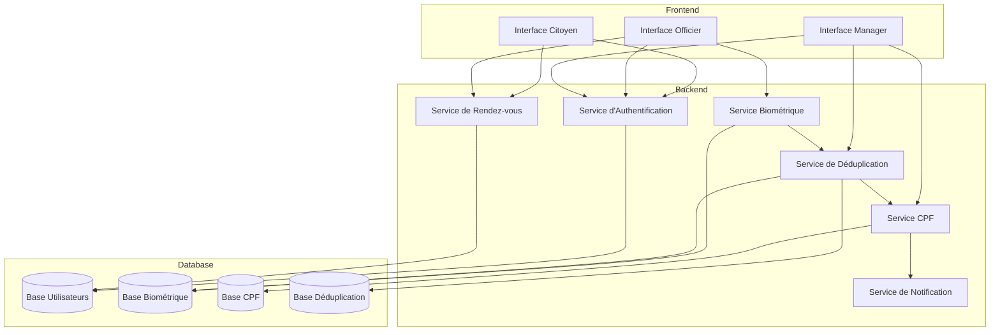
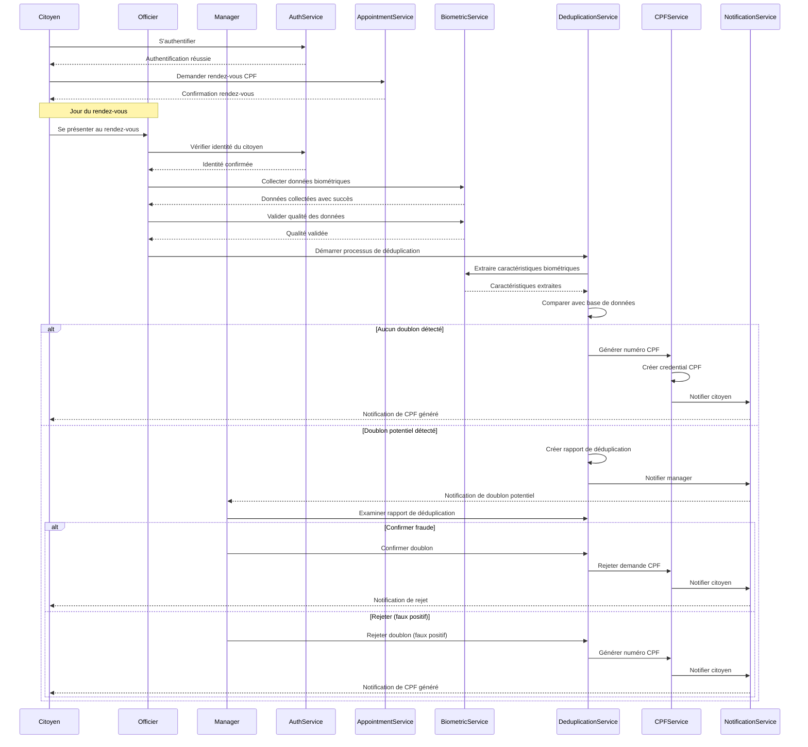

# Gestion CPF avec Déduplication Biométrique

## 1. Vue d'ensemble

Ce document détaille l'architecture et l'implémentation du système de gestion CPF intégré avec le processus de déduplication biométrique pour le projet Identity Secure. Cette fonctionnalité est au cœur du sprint 3 "Gérer CPF" et permet de garantir l'unicité des identifiants CPF attribués aux citoyens brésiliens.

## 2. Architecture globale



## 3. Flux de travail complet



## 4. Modèles de données

### 4.1 Modèle Citoyen (extension du modèle User)

```javascript
// back/models/citizen.model.js
const mongoose = require("mongoose");
const User = require("./user.model");

const citizenSchema = new mongoose.Schema({
  // Champs spécifiques au Citoyen
  identityNumber: {
    type: String,
    unique: true,
    sparse: true,
  },

  // CPF (spécifique au Citoyen)
  cpf: {
    number: {
      type: String,
      sparse: true,
      unique: true,
    },
    status: {
      type: String,
      enum: ["pending", "generated", "blocked"],
      default: "pending",
    },
    issueDate: Date,
    expiryDate: Date,
  },

  // Données biométriques (spécifiques au Citoyen)
  biometricData: {
    face: {
      type: mongoose.Schema.Types.ObjectId,
      ref: "Biometric",
    },
    fingerprints: {
      type: mongoose.Schema.Types.ObjectId,
      ref: "Biometric",
    },
    iris: {
      type: mongoose.Schema.Types.ObjectId,
      ref: "Biometric",
    },
  },

  // Statut de déduplication (spécifique au Citoyen)
  deduplicationStatus: {
    type: String,
    enum: ["not_started", "in_progress", "verified", "duplicate_found"],
    default: "not_started",
  },
});

// Créer le modèle Citoyen comme discriminator de User
const Citizen = User.discriminator("Citizen", citizenSchema);

module.exports = Citizen;
```

### 4.2 Modèle CPFCredential

```javascript
// back/models/cpfCredential.model.js
const mongoose = require("mongoose");

const cpfCredentialSchema = new mongoose.Schema(
  {
    userId: {
      type: mongoose.Schema.Types.ObjectId,
      ref: "User",
      required: true,
    },
    appointmentId: {
      type: mongoose.Schema.Types.ObjectId,
      ref: "Appointment",
      required: true,
    },
    biometricId: {
      type: mongoose.Schema.Types.ObjectId,
      ref: "Biometric",
      required: true,
    },
    credentialNumber: {
      type: String,
      required: true,
      unique: true,
    },
    issuedBy: {
      type: mongoose.Schema.Types.ObjectId,
      ref: "User", // Référence à l'officier ou au système
      required: true,
    },
    issuedAt: {
      type: Date,
      default: Date.now,
    },
    validUntil: {
      type: Date,
      required: true,
    },
    status: {
      type: String,
      enum: ["active", "expired", "revoked"],
      default: "active",
    },
    deduplicationRecord: {
      type: mongoose.Schema.Types.ObjectId,
      ref: "DeduplicationRecord",
    },
  },
  {
    timestamps: true,
  }
);

const CPFCredential = mongoose.model("CPFCredential", cpfCredentialSchema);

module.exports = CPFCredential;
```

### 4.3 Modèle DeduplicationRecord

```javascript
// back/models/deduplicationRecord.model.js
const mongoose = require("mongoose");

const deduplicationRecordSchema = new mongoose.Schema(
  {
    // Identifiants
    originalUserId: {
      type: mongoose.Schema.Types.ObjectId,
      ref: "User",
      required: true,
    },
    matchedUserId: {
      type: mongoose.Schema.Types.ObjectId,
      ref: "User",
      required: true,
    },

    // Scores de similarité
    faceMatchScore: {
      type: Number,
      min: 0,
      max: 100,
    },
    fingerprintMatchScores: [
      {
        finger: String,
        score: Number,
      },
    ],
    irisMatchScores: {
      left: Number,
      right: Number,
    },

    // Statut et décision
    status: {
      type: String,
      enum: ["pending", "confirmed", "rejected"],
      default: "pending",
    },

    // Métadonnées
    detectedAt: {
      type: Date,
      default: Date.now,
    },
    decidedBy: {
      type: mongoose.Schema.Types.ObjectId,
      ref: "User", // Référence au manager qui a pris la décision
    },
    decidedAt: Date,
    notes: String,
  },
  {
    timestamps: true,
  }
);

const DeduplicationRecord = mongoose.model(
  "DeduplicationRecord",
  deduplicationRecordSchema
);

module.exports = DeduplicationRecord;
```

## 5. Services principaux

### 5.1 Service de déduplication

```javascript
// back/services/deduplication.service.js
const BiometricModel = require("../models/biometric.model");
const DeduplicationRecord = require("../models/deduplicationRecord.model");
const Citizen = require("../models/citizen.model");
const cpfService = require("./cpf.service");
const notificationService = require("./notification.service");

class DeduplicationService {
  // Démarrer le processus de déduplication
  async startDeduplication(userId) {
    try {
      // 1. Mettre à jour le statut de déduplication
      await Citizen.findByIdAndUpdate(userId, {
        deduplicationStatus: "in_progress",
      });

      // 2. Récupérer les données biométriques
      const biometricData = await BiometricModel.findOne({ userId });
      if (!biometricData) {
        throw new Error("Biometric data not found");
      }

      // 3. Extraire les caractéristiques biométriques
      const faceTemplate = await this.extractFaceTemplate(biometricData.face);
      const fingerprintTemplates = await this.extractFingerprintTemplates(
        biometricData.fingerprints
      );

      // 4. Rechercher des correspondances dans la base de données
      const matches = await this.findMatches(
        userId,
        faceTemplate,
        fingerprintTemplates
      );

      // 5. Traiter les résultats
      if (matches.length > 0) {
        // Créer des enregistrements de déduplication pour chaque correspondance
        for (const match of matches) {
          await this.createDeduplicationRecord(userId, match);
        }

        // Mettre à jour le statut de déduplication
        await Citizen.findByIdAndUpdate(userId, {
          deduplicationStatus: "duplicate_found",
        });

        // Notifier les managers
        await notificationService.notifyManagers("duplicate_found", {
          userId,
          matchCount: matches.length,
        });

        return {
          status: "duplicate_found",
          matchCount: matches.length,
        };
      } else {
        // Aucune correspondance trouvée, générer le CPF
        await Citizen.findByIdAndUpdate(userId, {
          deduplicationStatus: "verified",
        });

        // Générer le CPF
        await cpfService.generateCPF(userId);

        return {
          status: "verified",
          message: "No duplicates found, CPF generated",
        };
      }
    } catch (error) {
      console.error("Deduplication error:", error);
      throw error;
    }
  }

  // Autres méthodes du service...
}

module.exports = new DeduplicationService();
```

### 5.2 Service CPF

```javascript
// back/services/cpf.service.js
const Citizen = require("../models/citizen.model");
const CPFCredential = require("../models/cpfCredential.model");
const Appointment = require("../models/appointment.model");
const notificationService = require("./notification.service");

class CPFService {
  // Générer un numéro CPF
  async generateCPF(userId) {
    try {
      // 1. Vérifier si l'utilisateur est éligible
      const citizen = await Citizen.findById(userId);
      if (!citizen) {
        throw new Error("Citizen not found");
      }

      if (citizen.deduplicationStatus !== "verified") {
        throw new Error("Citizen not verified through deduplication");
      }

      // 2. Générer un numéro CPF unique
      const cpfNumber = this.generateUniqueCPFNumber();

      // 3. Récupérer le rendez-vous associé
      const appointment = await Appointment.findOne({
        userId: userId,
        status: "completed",
      }).sort({ createdAt: -1 });

      if (!appointment) {
        throw new Error("No completed appointment found");
      }

      // 4. Récupérer les données biométriques
      const biometricId =
        citizen.biometricData.face ||
        citizen.biometricData.fingerprints ||
        citizen.biometricData.iris;

      if (!biometricId) {
        throw new Error("No biometric data found");
      }

      // 5. Créer les informations d'expiration
      const issueDate = new Date();
      const expiryDate = new Date();
      expiryDate.setFullYear(expiryDate.getFullYear() + 10); // Validité de 10 ans

      // 6. Créer la credential CPF
      const cpfCredential = new CPFCredential({
        userId: userId,
        appointmentId: appointment._id,
        biometricId: biometricId,
        credentialNumber: cpfNumber,
        issuedBy: appointment.officerId,
        issuedAt: issueDate,
        validUntil: expiryDate,
        status: "active",
      });

      await cpfCredential.save();

      // 7. Mettre à jour le citoyen
      citizen.cpf = {
        number: cpfNumber,
        status: "generated",
        issueDate: issueDate,
        expiryDate: expiryDate,
      };

      await citizen.save();

      // 8. Notifier le citoyen
      await notificationService.notifyCitizen(userId, "cpf_generated", {
        cpfNumber,
        issueDate,
        expiryDate,
      });

      return {
        success: true,
        cpfNumber,
        issueDate,
        expiryDate,
      };
    } catch (error) {
      console.error("CPF generation error:", error);
      throw error;
    }
  }

  // Générer un numéro CPF unique
  generateUniqueCPFNumber() {
    // Algorithme de génération de CPF brésilien
    // Format: XXX.XXX.XXX-XX
    // ...
    return "123.456.789-00"; // Exemple simplifié
  }

  // Autres méthodes du service...
}

module.exports = new CPFService();
```

## 6. Contrôleurs

### 6.1 Contrôleur de déduplication

```javascript
// back/controllers/deduplication.controller.js
const deduplicationService = require("../services/deduplication.service");

exports.startDeduplication = async (req, res) => {
  try {
    const { userId } = req.body;

    const result = await deduplicationService.startDeduplication(userId);

    res.status(200).json({
      success: true,
      ...result,
    });
  } catch (error) {
    res.status(500).json({
      success: false,
      message: error.message,
    });
  }
};

exports.getDeduplicationStatus = async (req, res) => {
  try {
    const { userId } = req.params;

    const status = await deduplicationService.getDeduplicationStatus(userId);

    res.status(200).json(status);
  } catch (error) {
    res.status(500).json({
      success: false,
      message: error.message,
    });
  }
};

exports.getDeduplicationRecords = async (req, res) => {
  try {
    const { userId } = req.params;

    const records = await deduplicationService.getDeduplicationRecords(userId);

    res.status(200).json(records);
  } catch (error) {
    res.status(500).json({
      success: false,
      message: error.message,
    });
  }
};

exports.makeDeduplicationDecision = async (req, res) => {
  try {
    const { recordId } = req.params;
    const { decision, notes } = req.body;

    const result = await deduplicationService.makeDecision(
      recordId,
      decision,
      notes,
      req.userId
    );

    res.status(200).json({
      success: true,
      ...result,
    });
  } catch (error) {
    res.status(500).json({
      success: false,
      message: error.message,
    });
  }
};
```

## 7. Routes API

```javascript
// back/routes/deduplication.routes.js
const express = require("express");
const router = express.Router();
const deduplicationController = require("../controllers/deduplication.controller");
const { authJwt } = require("../middlewares");

// Middleware pour vérifier les rôles
const isOfficer = [authJwt.verifyToken, authJwt.isOfficer];
const isManager = [authJwt.verifyToken, authJwt.isManager];

// Routes pour les officiers
router.post("/start", isOfficer, deduplicationController.startDeduplication);
router.get(
  "/status/:userId",
  isOfficer,
  deduplicationController.getDeduplicationStatus
);

// Routes pour les managers
router.get(
  "/records/:userId",
  isManager,
  deduplicationController.getDeduplicationRecords
);
router.post(
  "/decision/:recordId",
  isManager,
  deduplicationController.makeDeduplicationDecision
);
router.get(
  "/pending",
  isManager,
  deduplicationController.getPendingDeduplicationRecords
);
router.get(
  "/statistics",
  isManager,
  deduplicationController.getDeduplicationStatistics
);

module.exports = router;
```

## 8. Intégration frontend

### 8.1 Service de déduplication (Angular)

```typescript
// Front/app/core/services/deduplication.service.ts
import { Injectable } from "@angular/core";
import { HttpClient } from "@angular/common/http";
import { Observable } from "rxjs";

@Injectable({
  providedIn: "root",
})
export class DeduplicationService {
  private apiUrl = "/api/deduplication";

  constructor(private http: HttpClient) {}

  // Démarrer le processus de déduplication
  startDeduplication(userId: string): Observable<any> {
    return this.http.post(`${this.apiUrl}/start`, { userId });
  }

  // Obtenir le statut de déduplication
  getDeduplicationStatus(userId: string): Observable<any> {
    return this.http.get(`${this.apiUrl}/status/${userId}`);
  }

  // Obtenir les enregistrements de déduplication
  getDeduplicationRecords(userId: string): Observable<any> {
    return this.http.get(`${this.apiUrl}/records/${userId}`);
  }

  // Prendre une décision sur un enregistrement de déduplication
  makeDeduplicationDecision(
    recordId: string,
    decision: string,
    notes: string
  ): Observable<any> {
    return this.http.post(`${this.apiUrl}/decision/${recordId}`, {
      decision,
      notes,
    });
  }

  // Obtenir les enregistrements de déduplication en attente
  getPendingDeduplicationRecords(): Observable<any> {
    return this.http.get(`${this.apiUrl}/pending`);
  }

  // Obtenir les statistiques de déduplication
  getDeduplicationStatistics(): Observable<any> {
    return this.http.get(`${this.apiUrl}/statistics`);
  }
}
```

## 9. Sécurité et considérations

### 9.1 Sécurité des données biométriques

- Toutes les données biométriques sont chiffrées au repos avec AES-256
- Les templates biométriques sont stockés séparément des données brutes
- L'accès aux données biométriques est limité aux utilisateurs autorisés
- Les transmissions de données biométriques sont chiffrées avec TLS 1.3

### 9.2 Audit et traçabilité

- Toutes les actions de déduplication sont journalisées
- Les décisions des managers sont enregistrées avec horodatage
- Un historique complet des modifications est maintenu
- Des rapports d'audit peuvent être générés pour les autorités

### 9.3 Gestion des faux positifs

- Les managers peuvent rejeter les faux positifs
- Un système de feedback améliore continuellement les algorithmes
- Des seuils de similarité ajustables permettent d'optimiser la précision
- Des métriques de performance sont suivies pour évaluer l'efficacité
