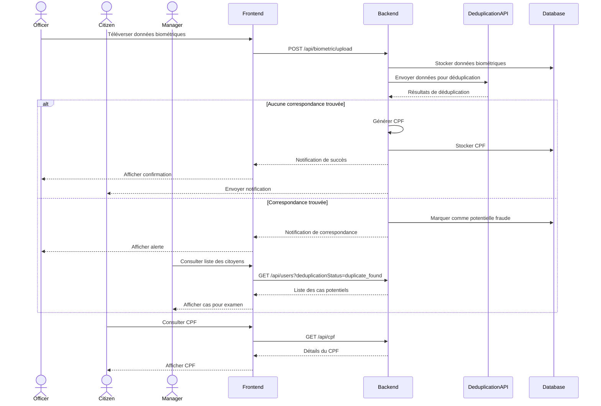

# Sprint 3 : Gérer CPF - Spécification Technique

## 1. Vue d'ensemble

Le sprint 3 "Gérer CPF" implémente le processus complet de gestion des identités brésiliennes, depuis la collecte des données biométriques jusqu'à la génération du CPF (Cadastro de Pessoas Físicas). Ce document détaille les interfaces, endpoints, algorithmes et flux de données nécessaires pour implémenter ce sprint.

## 2. Flux de travail principal



## 3. Modèles de données

### 3.1 Modèle BiometricData

```javascript
const biometricDataSchema = new mongoose.Schema({
  userId: {
    type: mongoose.Schema.Types.ObjectId,
    ref: 'User',
    required: true
  },
  face: {
    data: Buffer,
    contentType: String,
    quality: Number,
    uploadedAt: Date
  },
  fingerprints: [{
    finger: {
      type: String,
      enum: ['thumb_right', 'index_right', 'middle_right', 'ring_right', 'little_right',
             'thumb_left', 'index_left', 'middle_left', 'ring_left', 'little_left']
    },
    data: Buffer,
    contentType: String,
    quality: Number,
    uploadedAt: Date
  }],
  iris: {
    left: {
      data: Buffer,
      contentType: String,
      quality: Number,
      uploadedAt: Date
    },
    right: {
      data: Buffer,
      contentType: String,
      quality: Number,
      uploadedAt: Date
    }
  },
  collectedBy: {
    type: mongoose.Schema.Types.ObjectId,
    ref: 'User'
  },
  collectedAt: {
    type: Date,
    default: Date.now
  },
  verificationStatus: {
    type: String,
    enum: ['pending', 'verified', 'rejected'],
    default: 'pending'
  }
});
```

### 3.2 Modèle DeduplicationResult

```javascript
const deduplicationResultSchema = new mongoose.Schema({
  userId: {
    type: mongoose.Schema.Types.ObjectId,
    ref: 'User',
    required: true
  },
  biometricId: {
    type: mongoose.Schema.Types.ObjectId,
    ref: 'BiometricData',
    required: true
  },
  results: {
    faceMatches: [{
      userId: mongoose.Schema.Types.ObjectId,
      confidence: Number,
      matchedAt: Date
    }],
    fingerprintMatches: [{
      userId: mongoose.Schema.Types.ObjectId,
      finger: String,
      confidence: Number,
      matchedAt: Date
    }],
    irisMatches: [{
      userId: mongoose.Schema.Types.ObjectId,
      eye: String,
      confidence: Number,
      matchedAt: Date
    }]
  },
  overallResult: {
    type: String,
    enum: ['no_match', 'potential_match', 'confirmed_match'],
    required: true
  },
  processedAt: {
    type: Date,
    default: Date.now
  }
});
```

### 3.3 Modèle CPF

```javascript
const cpfSchema = new mongoose.Schema({
  userId: {
    type: mongoose.Schema.Types.ObjectId,
    ref: 'User',
    required: true
  },
  number: {
    type: String,
    unique: true,
    required: true
  },
  status: {
    type: String,
    enum: ['active', 'blocked', 'suspended'],
    default: 'active'
  },
  issuedAt: {
    type: Date,
    default: Date.now
  },
  expiresAt: {
    type: Date,
    required: true
  },
  transactions: [{
    type: String,
    timestamp: Date,
    details: Object
  }]
});
```

## 4. Endpoints API

### 4.1 Endpoints pour la gestion des données biométriques

#### 4.1.1 Téléverser des données biométriques

**Endpoint:** `POST /api/biometric/upload`

**Middleware:** `authJwt.verifyToken`, `authJwt.isOfficer`, `biometricConfig.uploadBiometricImages`

**Corps de la requête:**
```json
{
  "userId": "60d21b4667d0d8992e610c85",
  "appointmentId": "60d21b4667d0d8992e610c86"
}
```

**Fichiers:** Formulaire multipart avec les champs suivants:
- `face`: Image du visage (JPEG/PNG)
- `fingerprint_thumb_right`, `fingerprint_index_right`, etc.: Images des empreintes digitales
- `iris_left`, `iris_right`: Images des iris

**Réponse (succès):**
```json
{
  "message": "Biometric data uploaded successfully",
  "biometricId": "60d21b4667d0d8992e610c87",
  "deduplicationStatus": "in_progress"
}
```

**Codes d'erreur:**
- `400`: Données manquantes ou invalides
- `401`: Non autorisé
- `403`: Accès interdit
- `409`: Données biométriques déjà existantes pour cet utilisateur
- `500`: Erreur serveur

#### 4.1.2 Récupérer les données biométriques d'un utilisateur

**Endpoint:** `GET /api/biometric/:userId`

**Middleware:** `authJwt.verifyToken`, `authJwt.isOfficerOrManager`

**Réponse (succès):**
```json
{
  "id": "60d21b4667d0d8992e610c87",
  "userId": "60d21b4667d0d8992e610c85",
  "face": {
    "url": "/api/biometric/face/60d21b4667d0d8992e610c87",
    "quality": 0.95,
    "uploadedAt": "2023-06-24T10:30:00Z"
  },
  "fingerprints": [
    {
      "finger": "thumb_right",
      "url": "/api/biometric/fingerprint/60d21b4667d0d8992e610c87/thumb_right",
      "quality": 0.92,
      "uploadedAt": "2023-06-24T10:30:00Z"
    },
    // Autres doigts...
  ],
  "iris": {
    "left": {
      "url": "/api/biometric/iris/60d21b4667d0d8992e610c87/left",
      "quality": 0.97,
      "uploadedAt": "2023-06-24T10:30:00Z"
    },
    "right": {
      "url": "/api/biometric/iris/60d21b4667d0d8992e610c87/right",
      "quality": 0.96,
      "uploadedAt": "2023-06-24T10:30:00Z"
    }
  },
  "collectedBy": "60d21b4667d0d8992e610c88",
  "collectedAt": "2023-06-24T10:30:00Z",
  "verificationStatus": "verified"
}
```

### 4.2 Endpoints pour la déduplication

#### 4.2.1 Déclencher la déduplication

**Endpoint:** `POST /api/deduplication/process`

**Middleware:** `authJwt.verifyToken`, `authJwt.isOfficerOrManager`

**Corps de la requête:**
```json
{
  "biometricId": "60d21b4667d0d8992e610c87"
}
```

**Réponse (succès):**
```json
{
  "message": "Deduplication process started",
  "deduplicationId": "60d21b4667d0d8992e610c89"
}
```

#### 4.2.2 Récupérer les résultats de déduplication

**Endpoint:** `GET /api/deduplication/results/:userId`

**Middleware:** `authJwt.verifyToken`, `authJwt.isOfficerOrManager`

**Réponse (succès):**
```json
{
  "id": "60d21b4667d0d8992e610c89",
  "userId": "60d21b4667d0d8992e610c85",
  "biometricId": "60d21b4667d0d8992e610c87",
  "results": {
    "faceMatches": [
      {
        "userId": "60d21b4667d0d8992e610c90",
        "confidence": 0.85,
        "matchedAt": "2023-06-24T10:35:00Z"
      }
    ],
    "fingerprintMatches": [],
    "irisMatches": []
  },
  "overallResult": "potential_match",
  "processedAt": "2023-06-24T10:35:00Z"
}
```

### 4.3 Endpoints pour la gestion des CPF

#### 4.3.1 Générer un CPF

**Endpoint:** `POST /api/cpf/generate`

**Middleware:** `authJwt.verifyToken`, `authJwt.isOfficerOrManager`

**Corps de la requête:**
```json
{
  "userId": "60d21b4667d0d8992e610c85"
}
```

**Réponse (succès):**
```json
{
  "message": "CPF generated successfully",
  "cpf": {
    "id": "60d21b4667d0d8992e610c91",
    "number": "123.456.789-00",
    "status": "active",
    "issuedAt": "2023-06-24T11:00:00Z",
    "expiresAt": "2033-06-24T11:00:00Z"
  }
}
```

#### 4.3.2 Consulter un CPF (citoyen)

**Endpoint:** `GET /api/cpf`

**Middleware:** `authJwt.verifyToken`

**Réponse (succès):**
```json
{
  "id": "60d21b4667d0d8992e610c91",
  "number": "123.456.789-00",
  "status": "active",
  "issuedAt": "2023-06-24T11:00:00Z",
  "expiresAt": "2033-06-24T11:00:00Z",
  "transactions": [
    {
      "type": "issuance",
      "timestamp": "2023-06-24T11:00:00Z",
      "details": {
        "issuedBy": "60d21b4667d0d8992e610c88"
      }
    }
  ]
}
```

#### 4.3.3 Télécharger le certificat CPF

**Endpoint:** `GET /api/cpf/certificate`

**Middleware:** `authJwt.verifyToken`

**Réponse:** Fichier PDF du certificat CPF

### 4.4 Endpoints pour la gestion des citoyens

#### 4.4.1 Consulter la liste des citoyens

**Endpoint:** `GET /api/users`

**Middleware:** `authJwt.verifyToken`, `authJwt.isOfficerOrManager`

**Paramètres de requête:**
- `status`: Filtrer par statut utilisateur (active, suspended, blocked)
- `cpfStatus`: Filtrer par statut CPF (pending, generated, blocked)
- `deduplicationStatus`: Filtrer par statut de déduplication (not_started, in_progress, verified, duplicate_found)
- `page`: Numéro de page (défaut: 1)
- `limit`: Nombre d'éléments par page (défaut: 10)
- `search`: Recherche par nom, email ou numéro CPF

**Réponse (succès):**
```json
{
  "users": [
    {
      "id": "60d21b4667d0d8992e610c85",
      "firstName": "João",
      "lastName": "Silva",
      "email": "joao.silva@example.com",
      "status": "active",
      "cpf": {
        "number": "123.456.789-00",
        "status": "active"
      },
      "deduplicationStatus": "verified",
      "createdAt": "2023-06-20T09:00:00Z"
    },
    // Autres utilisateurs...
  ],
  "pagination": {
    "total": 45,
    "page": 1,
    "pages": 5
  }
}
```

## 5. Algorithmes

### 5.1 Algorithme de génération de CPF

Le CPF brésilien est un numéro à 11 chiffres avec 2 chiffres de vérification. L'algorithme de génération est le suivant:

```javascript
function generateCpf(name, birthDate, identityNumber) {
  // 1. Générer une base de 9 chiffres à partir des informations de l'utilisateur
  const uniqueString = `${name.toLowerCase().replace(/\s/g, '')}${birthDate.replace(/-/g, '')}${identityNumber}`;
  const hash = crypto.createHash('md5').update(uniqueString).digest('hex');
  const cpfBase = hash.replace(/\D/g, '').slice(0, 9).padStart(9, '0');
  
  // 2. Calculer le premier chiffre de vérification
  let sum = 0;
  for (let i = 0; i < 9; i++) {
    sum += parseInt(cpfBase.charAt(i)) * (10 - i);
  }
  const remainder1 = sum % 11;
  const firstDigit = remainder1 < 2 ? '0' : (11 - remainder1).toString();
  
  // 3. Calculer le second chiffre de vérification
  sum = 0;
  for (let i = 0; i < 9; i++) {
    sum += parseInt(cpfBase.charAt(i)) * (11 - i);
  }
  sum += parseInt(firstDigit) * 2;
  const remainder2 = sum % 11;
  const secondDigit = remainder2 < 2 ? '0' : (11 - remainder2).toString();
  
  // 4. Formater le CPF
  return `${cpfBase.slice(0, 3)}.${cpfBase.slice(3, 6)}.${cpfBase.slice(6, 9)}-${firstDigit}${secondDigit}`;
}
```

### 5.2 Algorithme de déduplication biométrique

La déduplication biométrique utilise une API externe avec les étapes suivantes:

1. **Préparation des données:**
   - Normalisation des images (taille, orientation, luminosité)
   - Extraction des caractéristiques biométriques (minuties pour les empreintes, points de repère pour le visage, motifs pour l'iris)

2. **Comparaison multimodale:**
   - Comparaison des empreintes digitales avec la base de données (algorithme NIST BOZORTH3)
   - Comparaison faciale (algorithme de reconnaissance faciale basé sur des réseaux de neurones)
   - Comparaison des iris (algorithme de Daugman)

3. **Calcul des scores de confiance:**
   - Score de confiance pour chaque modalité (0.0 à 1.0)
   - Score combiné avec pondération (visage: 0.3, empreintes: 0.5, iris: 0.2)

4. **Décision basée sur des seuils:**
   - Score < 0.6: Pas de correspondance
   - Score 0.6-0.8: Correspondance potentielle (nécessite vérification manuelle)
   - Score > 0.8: Correspondance confirmée

## 6. Interfaces utilisateur

### 6.1 Interface "Téléverser Données Biométriques" (Officier)

Cette interface permet à l'officier de police de capturer et d'enregistrer les données biométriques d'un citoyen lors d'un rendez-vous validé.

**Fonctionnalités:**
- Capture de photo du visage avec vérification de qualité
- Capture des empreintes digitales (10 doigts) avec vérification de qualité
- Capture des iris (gauche et droit) avec vérification de qualité
- Indicateurs de qualité en temps réel
- Bouton de soumission des données
- Affichage du résultat de la déduplication

### 6.2 Interface "Consulter CPF" (Citoyen)

Cette interface permet au citoyen de visualiser son numéro CPF et les informations associées.

**Fonctionnalités:**
- Affichage du numéro CPF
- Affichage du statut du CPF
- Historique des transactions
- Bouton pour télécharger le certificat CPF
- Option pour signaler une utilisation frauduleuse

### 6.3 Interface "Consulter liste citoyens" (Manager/Officier)

Cette interface permet au manager CPF et à l'officier de police de consulter la liste des citoyens avec différents filtres.

**Fonctionnalités:**
- Liste paginée des citoyens
- Filtres par statut (actif, suspendu, bloqué)
- Filtres par état de génération du CPF (en attente, généré, bloqué)
- Filtres par statut de déduplication
- Recherche par nom, email ou numéro CPF
- Vue détaillée d'un citoyen sélectionné

## 7. Gestion des erreurs et exceptions

### 7.1 Erreurs de téléversement biométrique

- **Qualité insuffisante:** Si la qualité d'une image biométrique est inférieure au seuil requis, l'interface affiche un message d'erreur et demande une nouvelle capture.
- **Données incomplètes:** Si toutes les données biométriques requises ne sont pas fournies, l'API renvoie une erreur 400.
- **Erreur de stockage:** En cas d'erreur lors du stockage des données, l'API renvoie une erreur 500 et journalise l'erreur.

### 7.2 Erreurs de déduplication

- **API externe indisponible:** Si l'API de déduplication est indisponible, le système met la demande en file d'attente et réessaie plus tard.
- **Résultats ambigus:** Si les résultats de déduplication sont ambigus, le système marque le cas pour une vérification manuelle.

### 7.3 Erreurs de génération de CPF

- **Données utilisateur incomplètes:** Si les données nécessaires à la génération du CPF sont incomplètes, l'API renvoie une erreur 400.
- **Conflit de numéro:** Si le numéro CPF généré existe déjà, l'algorithme génère un nouveau numéro.

## 8. Sécurité

- Toutes les données biométriques sont chiffrées au repos (AES-256) et en transit (TLS 1.3).
- L'accès aux endpoints est protégé par authentification JWT et contrôle d'accès basé sur les rôles.
- Les téléchargements de certificats CPF nécessitent une authentification à deux facteurs.
- Toutes les actions sont journalisées pour audit.

## 9. Tests

- Tests unitaires pour les algorithmes de génération de CPF et de déduplication
- Tests d'intégration pour les endpoints API
- Tests de bout en bout pour les flux complets
- Tests de charge pour vérifier les performances sous charge élevée
- Tests de sécurité (injection, XSS, CSRF)
