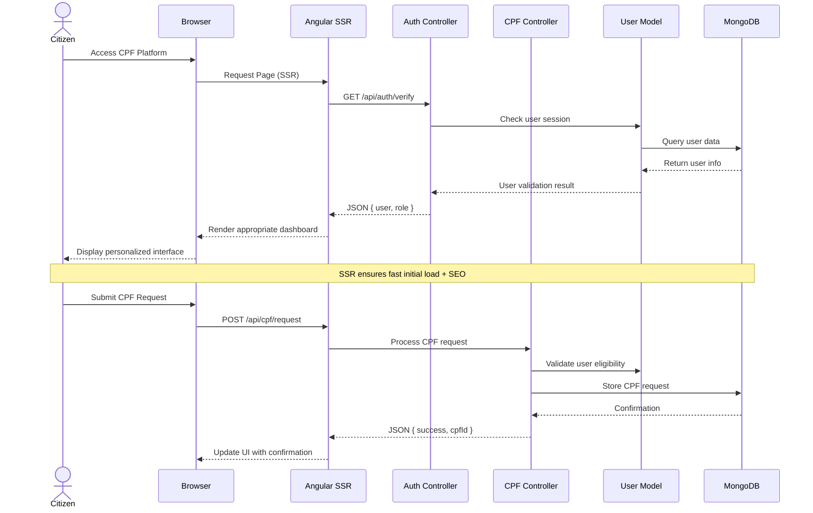
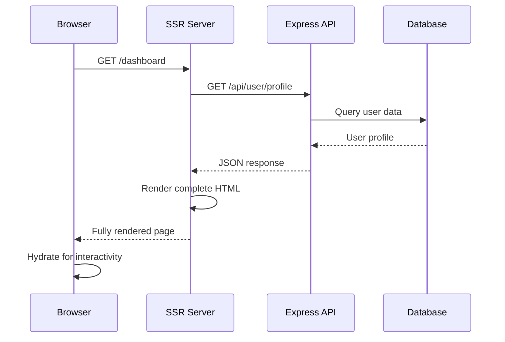

# Complete Angular Rendering Strategies & MVC Architecture Course

## Course Overview

This comprehensive course covers Angular rendering strategies, MVC architecture patterns, and their practical implementation in modern web applications. Using our civic platform project as a real-world example, you'll learn from basic concepts to advanced optimization techniques.

### Course Objectives

- Understand different rendering strategies and when to use them
- Master MVC architecture in distributed Angular + Express applications
- Implement Server-Side Rendering (SSR) with Angular Universal
- Apply performance optimization and security best practices
- Build scalable, maintainable applications with proper architecture

### Prerequisites

- Basic Angular knowledge (components, services, routing)
- Understanding of TypeScript and JavaScript
- Familiarity with Node.js and Express
- Basic knowledge of HTTP and REST APIs

---

# Table of Contents

## Chapter 1: Fundamentals of Web Rendering

## Chapter 2: Angular Rendering Strategies Overview

## Chapter 3: MVC Architecture in Modern Web Applications

## Chapter 4: Server-Side Rendering (SSR) Deep Dive

## Chapter 5: Implementation Patterns & Best Practices

## Chapter 6: Performance Optimization Strategies

## Chapter 7: Security & Testing in SSR Applications

## Chapter 8: Advanced Architecture Patterns

## Chapter 9: Real-World Project Implementation

## Chapter 10: Troubleshooting & Maintenance

---

# Chapter 1: Fundamentals of Web Rendering

## 1.1 What is Rendering?

Rendering is the process of converting your Angular components and templates into HTML that browsers can display. The **where** and **when** this happens determines the rendering strategy.

## 1.2 The Evolution of Web Rendering

### Traditional Server-Side Rendering (Classic Web)

```
Browser Request → Server Processes → Complete HTML → Browser Displays
```

### Single Page Applications (SPA Era)

```
Browser Request → Empty HTML + JS → Client Renders → Interactive App
```

### Modern Hybrid Approaches

```
Browser Request → Pre-rendered HTML → Client Hydrates → Enhanced Interactivity
```

## 1.3 Key Concepts

- **Hydration**: Process of making server-rendered HTML interactive
- **Time to First Byte (TTFB)**: Server response time
- **First Contentful Paint (FCP)**: When content first appears
- **Time to Interactive (TTI)**: When page becomes fully interactive

---

# Chapter 2: Angular Rendering Strategies Overview

## 2.1 Available Rendering Strategies

### 2.1.1 Client-Side Rendering (CSR) - Default Angular

**How it works:**

- Browser downloads minimal HTML shell + JavaScript bundles
- JavaScript executes in browser to build the entire page
- All rendering happens on the client-side

**Process Flow:**

```
Browser Request → Empty HTML + JS Bundle → JS Executes → Page Rendered
```

**Pros:**

- ✅ Simple setup (default Angular behavior)
- ✅ Rich interactivity and smooth navigation
- ✅ Good for complex applications
- ✅ No server infrastructure needed
- ✅ Excellent for SPAs (Single Page Applications)

**Cons:**

- ❌ Slow initial page load (blank screen while JS loads)
- ❌ Poor SEO (search engines see empty page)
- ❌ Poor performance on slow devices/connections
- ❌ JavaScript required for any content display

**Best for:**

- Internal dashboards and admin panels
- Complex web applications with heavy user interaction
- Applications where SEO is not important
- Users with reliable internet connections

**Implementation:**

```bash
# Default Angular setup
ng new my-app
ng serve
```

### 2.1.2 Server-Side Rendering (SSR) - Angular Universal

**How it works:**

- Server renders complete HTML with content
- Browser receives fully rendered page
- JavaScript "hydrates" the page to add interactivity

**Process Flow:**

```
Browser Request → Server Renders → Complete HTML → JS Hydrates → Interactive Page
```

**Pros:**

- ✅ Fast initial page load (content visible immediately)
- ✅ Excellent SEO (search engines see complete content)
- ✅ Better performance on slow devices
- ✅ Works without JavaScript enabled
- ✅ Improved Core Web Vitals scores

**Cons:**

- ❌ More complex setup and deployment
- ❌ Requires server infrastructure (Node.js)
- ❌ Potential hydration mismatches
- ❌ Some browser APIs not available on server
- ❌ Higher server resource usage

**Best for:**

- Public-facing websites
- E-commerce platforms
- Marketing and content sites
- Applications requiring SEO
- Government/civic platforms (like ours)

**Implementation:**

```bash
# Add SSR to existing project
ng add @angular/ssr

# Build for SSR
ng build

# Serve SSR application
npm run serve:ssr
```

### 2.1.3 Static Site Generation (SSG) - Prerendering

**How it works:**

- Pages are pre-rendered at **build time**
- Static HTML files are generated for each route
- No server needed for rendering

**Process Flow:**

```
Build Time → Generate Static HTML → Deploy Static Files → Instant Load
```

**Pros:**

- ✅ Fastest possible loading (pre-generated HTML)
- ✅ Excellent SEO
- ✅ Can be hosted on CDN (very cheap hosting)
- ✅ Maximum security (no server-side code)
- ✅ Perfect lighthouse scores

**Cons:**

- ❌ Only works for static/semi-static content
- ❌ Build time increases with number of pages
- ❌ Dynamic content requires rebuilds
- ❌ Not suitable for user-specific content
- ❌ Limited real-time data capabilities

**Best for:**

- Documentation sites
- Blogs and marketing pages
- Portfolios
- Landing pages
- Content that doesn't change frequently

**Implementation:**

```bash
# Add SSR first
ng add @angular/ssr

# Build with prerendering
ng build --prerender

# Or specify routes
ng build --prerender --routes /home /about /contact
```

### 2.1.4 Incremental Static Regeneration (ISR)

**How it works:**

- Combines SSG with on-demand regeneration
- Pages are statically generated but can be updated
- Stale pages are regenerated in background

**Process Flow:**

```
Build Time → Static HTML → User Request → Check Freshness → Regenerate if Stale
```

**Pros:**

- ✅ Fast like SSG
- ✅ Can handle dynamic content
- ✅ Automatic cache invalidation
- ✅ Scalable architecture
- ✅ Best of SSG and SSR

**Cons:**

- ❌ Complex setup and configuration
- ❌ Requires special hosting platform
- ❌ Angular support limited (better in Next.js)
- ❌ Debugging complexity

**Best for:**

- E-commerce with frequent product updates
- News sites with regular content
- Large content sites
- Applications with mixed static/dynamic content

### 2.1.5 Hybrid Rendering

**How it works:**

- Different pages use different rendering strategies
- Mix SSR, SSG, and CSR in same application
- Route-level rendering decisions

**Process Flow:**

```
Route Analysis → Choose Strategy → Apply Appropriate Rendering
```

**Pros:**

- ✅ Optimal performance per page type
- ✅ Flexible architecture
- ✅ Best of all worlds
- ✅ Can optimize each route individually

**Cons:**

- ❌ Most complex setup
- ❌ Requires careful planning and architecture
- ❌ Harder to debug and maintain
- ❌ Team needs expertise in multiple strategies

**Best for:**

- Large applications with varied content types
- Enterprise applications
- Platforms with different user types
- Applications requiring maximum optimization

## 2.2 Comparison Matrix

| Feature                | CSR       | SSR       | SSG       | ISR       | Hybrid    |
| ---------------------- | --------- | --------- | --------- | --------- | --------- |
| **Initial Load Speed** | Slow      | Fast      | Fastest   | Fastest   | Varies    |
| **SEO Quality**        | Poor      | Excellent | Excellent | Excellent | Excellent |
| **Server Required**    | No        | Yes       | No        | Yes       | Varies    |
| **Dynamic Content**    | Excellent | Good      | Poor      | Good      | Excellent |
| **Setup Complexity**   | Simple    | Medium    | Medium    | High      | High      |
| **Hosting Cost**       | Low       | Medium    | Low       | Medium    | Medium    |
| **Build Time**         | Fast      | Fast      | Slow      | Medium    | Medium    |
| **Maintenance**        | Easy      | Medium    | Easy      | Hard      | Hard      |

## 2.3 Decision Framework: Choosing the Right Strategy

### 2.3.1 Decision Tree

```
Is SEO important?
├── No → Consider CSR
└── Yes
    ├── Content changes frequently?
    │   ├── Yes → SSR
    │   └── No → SSG
    └── Mixed content types?
        └── Yes → Hybrid
```

### 2.3.2 Performance Considerations

- **Time to First Byte (TTFB)**: SSG < SSR < CSR
- **First Contentful Paint (FCP)**: SSG ≈ SSR < CSR
- **Time to Interactive (TTI)**: CSR < SSR < SSG
- **Bundle Size Impact**: All strategies benefit from code splitting

---

# Chapter 3: MVC Architecture in Modern Web Applications

## 3.1 Understanding Distributed MVC

### 3.1.1 Traditional MVC vs Modern Distributed MVC

**Traditional MVC (Server-Side)**

```
Browser Request → Server (Model + Controller + View) → Complete HTML
```

**Modern Distributed MVC (Angular + Express)**

```
Browser Request → Express Controller → Model → JSON Response → Angular View
```

### 3.1.2 MVC Architecture in Our Full-Stack Application

In our civic platform using Node.js (Express) backend and Angular frontend, the MVC pattern is **distributed** between backend and frontend:

- **Model**: Located on the server (Express + MongoDB for user data, CPF records, etc.)
- **Controller**: Node.js/Express handles API requests (auth, CPF processing, user management)
- **View**: Entirely handled by Angular on the frontend (dashboards, forms, components)

Unlike traditional server-rendered MVC, our Express backend functions as a **REST API provider**, while Angular renders the UI in the browser with SSR capabilities.

## 3.2 Architecture Flow in Our Project



## 3.3 Angular Lifecycle Hooks in MVC Context

### 3.3.1 Lifecycle Hooks Overview

| Hook                | Purpose                    | MVC Role                          | SSR Considerations            |
| ------------------- | -------------------------- | --------------------------------- | ----------------------------- |
| `ngOnInit()`        | Component initialization   | View initialization, data loading | Platform-aware initialization |
| `ngOnChanges()`     | Input property changes     | View updates from parent          | Safe for SSR                  |
| `ngDoCheck()`       | Custom change detection    | Advanced view logic               | Use sparingly                 |
| `ngAfterViewInit()` | View and child views ready | DOM manipulation                  | Browser-only operations       |
| `ngOnDestroy()`     | Cleanup before destruction | Resource cleanup                  | Subscription cleanup          |

### 3.3.2 Lifecycle Hooks in Our Project Context

| Hook                | Usage in Our Platform                                  | Example                  |
| ------------------- | ------------------------------------------------------ | ------------------------ |
| `ngOnInit()`        | Load user data, check authentication, fetch CPF status | Dashboard initialization |
| `ngOnChanges()`     | React to role changes, update form permissions         | Role-based form updates  |
| `ngDoCheck()`       | Custom fraud detection checks                          | Biometric validation     |
| `ngAfterViewInit()` | Initialize maps, charts, file upload components        | Center location maps     |
| `ngOnDestroy()`     | Cleanup subscriptions, close WebSocket connections     | Real-time notifications  |

---

# Chapter 4: Server-Side Rendering (SSR) Deep Dive

## 4.1 Our Project Implementation

### 4.1.1 Current Setup: SSR (Server-Side Rendering)

Our application currently uses **SSR** with the following configuration:

**Configuration Files:**

- `angular.json`: SSR entry point configured
- `src/server.ts`: Express server for SSR
- `src/main.server.ts`: Server-side bootstrap
- `src/app/app.config.server.ts`: Server-specific configuration

**Why SSR is Perfect for Our Project:**

1. **Public-Facing Platform**: Citizens need fast, accessible pages
2. **SEO Critical**: Government services must be discoverable
3. **Performance Important**: Citizens may have slower devices/connections
4. **Trust Factor**: Fast-loading pages increase user confidence
5. **Accessibility**: Works without JavaScript for basic functionality

### 4.1.2 Recommended Hybrid Approach

For optimal performance, consider this hybrid strategy:

```typescript
// Route-based rendering strategy
const routes = [
  // Static pages - use SSG
  { path: "", component: LandingComponent, prerender: true },
  { path: "about", component: AboutComponent, prerender: true },
  { path: "services", component: ServicesComponent, prerender: true },

  // Dynamic user pages - use SSR
  { path: "login", component: LoginComponent, ssr: true },
  { path: "register", component: RegisterComponent, ssr: true },
  { path: "cpf-request", component: CpfRequestComponent, ssr: true },

  // User dashboards - use CSR
  { path: "dashboard", component: DashboardComponent, csr: true },
  { path: "profile", component: ProfileComponent, csr: true },
];
```

## 4.2 Implementation Commands

### 4.2.1 Current SSR Setup

```bash
# Development
ng serve

# Production build
ng build
npm run serve:ssr

# Check SSR is working
curl http://localhost:4000
```

### 4.2.2 Adding Prerendering (SSG)

```bash
# Build with prerendering for static pages
ng build --prerender --routes /home /about /services /contact

# Serve prerendered files
npx http-server dist/pfe-v0/browser
```

### 4.2.3 Performance Monitoring

```bash
# Lighthouse audit
npx lighthouse http://localhost:4200 --view

# Bundle analysis
npx webpack-bundle-analyzer dist/pfe-v0/browser/main.js
```

## Best Practices

### For SSR Applications:

1. **Avoid browser-only APIs** in components that render on server
2. **Use `isPlatformBrowser()`** to check execution environment
3. **Implement proper error handling** for server-side rendering
4. **Optimize server response times**
5. **Use caching strategies** for frequently accessed content

### For Performance:

1. **Lazy load routes** and modules
2. **Implement proper caching headers**
3. **Optimize images and assets**
4. **Use CDN for static assets**
5. **Monitor Core Web Vitals**

## Troubleshooting Common Issues

### SSR Hydration Mismatches

```typescript
// Use NgZone to handle client-only code
constructor(private ngZone: NgZone, @Inject(PLATFORM_ID) private platformId: Object) {}

ngOnInit() {
  if (isPlatformBrowser(this.platformId)) {
    this.ngZone.runOutsideAngular(() => {
      // Browser-only code here
    });
  }
}
```

### Server-Side API Calls

```typescript
// Use absolute URLs for server-side requests
const apiUrl = isPlatformServer(this.platformId) ? "http://localhost:8080/api" : "/api";
```

---

## Understanding MVC with Node.js (Express) and Angular: Academic Overview

### MVC Architecture in Our Full-Stack Application

In our civic platform using Node.js (Express) backend and Angular frontend, the MVC pattern is **distributed** between backend and frontend:

- **Model**: Located on the server (Express + MongoDB for user data, CPF records, etc.)
- **Controller**: Node.js/Express handles API requests (auth, CPF processing, user management)
- **View**: Entirely handled by Angular on the frontend (dashboards, forms, components)

Unlike traditional server-rendered MVC, our Express backend functions as a **REST API provider**, while Angular renders the UI in the browser with SSR capabilities.

### Architecture Flow in Our Project


### Data Flow in Our Angular Components

#### Example: CPF Request Component with SSR

```typescript
// cpf-request.component.ts
export class CpfRequestComponent implements OnInit, OnChanges {
  @Input() userRole!: string;
  cpfRequest!: CPFRequest;
  isSubmitting = false;

  constructor(private cpfService: CPFService, private authService: AuthService, @Inject(PLATFORM_ID) private platformId: Object) {}

  ngOnInit(): void {
    // SSR-safe initialization
    if (isPlatformBrowser(this.platformId)) {
      this.loadUserEligibility();
    }
  }

  ngOnChanges(changes: SimpleChanges): void {
    if (changes["userRole"] && !changes["userRole"].firstChange) {
      this.updateFormBasedOnRole(changes["userRole"].currentValue);
    }
  }

  private loadUserEligibility(): void {
    this.cpfService.checkEligibility().subscribe({
      next: (eligibility) => {
        this.cpfRequest = new CPFRequest(eligibility);
      },
      error: (error) => {
        console.error("Eligibility check failed:", error);
      },
    });
  }
}
```

#### Example: Officer Dashboard with Real-time Updates

```typescript
// officer-dashboard.component.ts
export class OfficerDashboardComponent implements OnInit, OnDestroy {
  pendingRequests: CPFRequest[] = [];
  private subscription = new Subscription();

  constructor(private cpfService: CPFService, private websocketService: WebSocketService) {}

  ngOnInit(): void {
    this.loadPendingRequests();
    this.subscribeToRealTimeUpdates();
  }

  ngOnDestroy(): void {
    this.subscription.unsubscribe();
  }

  private subscribeToRealTimeUpdates(): void {
    this.subscription.add(
      this.websocketService.onNewCPFRequest().subscribe((request) => {
        this.pendingRequests.unshift(request);
      })
    );
  }
}
```

### Angular Lifecycle Hooks in Our Project Context

| Hook                | Usage in Our Platform                                  | Example                  |
| ------------------- | ------------------------------------------------------ | ------------------------ |
| `ngOnInit()`        | Load user data, check authentication, fetch CPF status | Dashboard initialization |
| `ngOnChanges()`     | React to role changes, update form permissions         | Role-based form updates  |
| `ngDoCheck()`       | Custom fraud detection checks                          | Biometric validation     |
| `ngAfterViewInit()` | Initialize maps, charts, file upload components        | Center location maps     |
| `ngOnDestroy()`     | Cleanup subscriptions, close WebSocket connections     | Real-time notifications  |

### SSR-Specific Considerations in Our MVC Flow

#### Server-Side Rendering Flow



#### Platform-Aware Code Examples

```typescript
// Platform-aware service calls
@Injectable()
export class CPFService {
  constructor(private http: HttpClient, @Inject(PLATFORM_ID) private platformId: Object) {}

  getApiUrl(): string {
    // Use absolute URL for SSR, relative for browser
    return isPlatformServer(this.platformId) ? "http://localhost:8080/api" : "/api";
  }

  checkCPFStatus(userId: string): Observable<CPFStatus> {
    const url = `${this.getApiUrl()}/cpf/status/${userId}`;
    return this.http.get<CPFStatus>(url);
  }
}
```

## 6.1 Lazy Loading by User Role

```typescript
// app-routing.module.ts
const routes: Routes = [
  {
    path: "citizen",
    loadChildren: () => import("./citizen/citizen.module").then((m) => m.CitizenModule),
    canActivate: [RoleGuard],
    data: { role: "citizen" },
  },
  {
    path: "officer",
    loadChildren: () => import("./officer/officer.module").then((m) => m.OfficerModule),
    canActivate: [RoleGuard],
    data: { role: "officer" },
  },
  {
    path: "manager",
    loadChildren: () => import("./manager/manager.module").then((m) => m.ManagerModule),
    canActivate: [RoleGuard],
    data: { role: "manager" },
  },
];
```

## 6.2 OnPush Change Detection Strategy

```typescript
@Component({
  selector: "app-cpf-card",
  changeDetection: ChangeDetectionStrategy.OnPush,
  template: `
    <div class="cpf-card">
      <h3>{{ request.applicantName }}</h3>
      <p>Status: {{ request.status }}</p>
      <button (click)="onApprove()" [disabled]="processing">
        {{ processing ? "Processing..." : "Approve" }}
      </button>
    </div>
  `,
})
export class CPFCardComponent {
  @Input() request!: CPFRequest;
  @Input() processing = false;
  @Output() approve = new EventEmitter<void>();

  constructor(private cdr: ChangeDetectorRef) {}

  onApprove(): void {
    this.approve.emit();
    this.cdr.markForCheck(); // Manual change detection trigger
  }
}
```

## 6.3 Bundle Optimization Techniques

### 6.3.1 Tree Shaking

```typescript
// Import only what you need
import { map, filter } from "rxjs/operators";
// Instead of: import * as operators from 'rxjs/operators';
```

### 6.3.2 Code Splitting

```typescript
// Dynamic imports for large libraries
async loadChartLibrary() {
  const { Chart } = await import('chart.js');
  return Chart;
}
```

---

# Chapter 7: Security & Testing in SSR Applications

## 7.1 Security Considerations in MVC Flow

### 7.1.1 JWT Token Handling

```typescript
// auth.interceptor.ts
@Injectable()
export class AuthInterceptor implements HttpInterceptor {
  intercept(req: HttpRequest<any>, next: HttpHandler): Observable<HttpEvent<any>> {
    const token = this.authService.getToken();

    if (token && !this.isPublicRoute(req.url)) {
      const authReq = req.clone({
        setHeaders: {
          Authorization: `Bearer ${token}`,
        },
      });
      return next.handle(authReq);
    }

    return next.handle(req);
  }
}
```

### 7.1.2 Role-Based Access Control

```typescript
// role.guard.ts
@Injectable()
export class RoleGuard implements CanActivate {
  canActivate(route: ActivatedRouteSnapshot): boolean {
    const requiredRole = route.data["role"];
    const userRole = this.authService.getUserRole();

    return this.authService.hasRole(requiredRole);
  }
}
```

### 7.1.3 XSS Protection in SSR

```typescript
// Sanitize user input in SSR context
@Injectable()
export class SanitizationService {
  constructor(@Inject(DOCUMENT) private document: Document) {}

  sanitizeHtml(html: string): string {
    if (isPlatformBrowser(this.platformId)) {
      // Use DOMPurify in browser
      return DOMPurify.sanitize(html);
    } else {
      // Use server-side sanitization
      return this.serverSanitize(html);
    }
  }
}
```

## 7.2 Testing Strategies for SSR Components

### 7.2.1 Platform-Aware Testing

```typescript
// cpf-request.component.spec.ts
describe("CPFRequestComponent", () => {
  let component: CPFRequestComponent;
  let fixture: ComponentFixture<CPFRequestComponent>;

  beforeEach(() => {
    TestBed.configureTestingModule({
      declarations: [CPFRequestComponent],
      providers: [
        { provide: PLATFORM_ID, useValue: "browser" },
        { provide: CPFService, useValue: mockCPFService },
      ],
    });
  });

  it("should handle SSR environment", () => {
    // Test SSR-specific behavior
    const platformId = TestBed.inject(PLATFORM_ID);
    expect(isPlatformBrowser(platformId)).toBe(true);
  });

  it("should load user eligibility on init", fakeAsync(() => {
    component.ngOnInit();
    tick();
    expect(component.cpfRequest).toBeDefined();
  }));
});
```

### 7.2.2 SSR Integration Testing

```typescript
// ssr.integration.spec.ts
describe("SSR Integration", () => {
  it("should render complete HTML on server", async () => {
    const response = await request(app).get("/dashboard").expect(200);

    expect(response.text).toContain("<app-dashboard>");
    expect(response.text).toContain("Dashboard Content");
  });
});
```

---

# Chapter 8: Advanced Architecture Patterns

## 8.1 Smart vs Presentational Components

### 8.1.1 Container Pattern Implementation

```typescript
// Smart Component (Container)
@Component({
  selector: "app-cpf-management",
  template: ` <app-cpf-list [requests]="cpfRequests$ | async" [loading]="loading" (approve)="onApprove($event)" (reject)="onReject($event)"> </app-cpf-list> `,
})
export class CPFManagementComponent {
  cpfRequests$ = this.store.select(selectPendingCPFRequests);
  loading = false;

  onApprove(requestId: string): void {
    this.store.dispatch(approveCPFRequest({ requestId }));
  }
}

// Presentational Component
@Component({
  selector: "app-cpf-list",
  template: `
    <div *ngFor="let request of requests">
      <app-cpf-card [request]="request" (approve)="approve.emit(request.id)" (reject)="reject.emit(request.id)"> </app-cpf-card>
    </div>
  `,
})
export class CPFListComponent {
  @Input() requests: CPFRequest[] = [];
  @Input() loading = false;
  @Output() approve = new EventEmitter<string>();
  @Output() reject = new EventEmitter<string>();
}
```

## 8.2 State Management with NgRx

### 8.2.1 CPF State Management

```typescript
// CPF State Management
interface CPFState {
  requests: CPFRequest[];
  selectedRequest: CPFRequest | null;
  loading: boolean;
  error: string | null;
}

// Actions
export const loadCPFRequests = createAction("[CPF] Load Requests");
export const loadCPFRequestsSuccess = createAction("[CPF] Load Requests Success", props<{ requests: CPFRequest[] }>());

// Effects
@Injectable()
export class CPFEffects {
  loadRequests$ = createEffect(() =>
    this.actions$.pipe(
      ofType(loadCPFRequests),
      switchMap(() =>
        this.cpfService.getRequests().pipe(
          map((requests) => loadCPFRequestsSuccess({ requests })),
          catchError((error) => of(loadCPFRequestsFailure({ error })))
        )
      )
    )
  );
}
```

## 8.3 Micro-Frontend Architecture

### 8.3.1 Module Federation Setup

```typescript
// webpack.config.js for micro-frontend
const ModuleFederationPlugin = require("@angular-architects/module-federation/webpack");

module.exports = {
  plugins: [
    new ModuleFederationPlugin({
      name: "citizen-portal",
      exposes: {
        "./CitizenModule": "./src/app/citizen/citizen.module.ts",
      },
    }),
  ],
};
```

---

# Chapter 9: Real-World Project Implementation

## 9.1 Our Civic Platform Architecture

### 9.1.1 Project Overview

Our civic platform demonstrates a complete SSR implementation with:

- **Multi-role authentication** (Citizen, Officer, Manager)
- **CPF processing workflow** with fraud detection
- **Real-time notifications** via WebSocket
- **Biometric integration** for identity verification
- **Document generation** for official certificates

### 9.1.2 Technology Stack

- **Frontend**: Angular 19 with SSR
- **Backend**: Node.js + Express
- **Database**: MongoDB
- **Authentication**: JWT with refresh tokens
- **Real-time**: WebSocket connections
- **Deployment**: Vercel (frontend) + Render (backend)

## 9.2 Implementation Highlights

### 9.2.1 SSR Configuration

```typescript
// angular.json - SSR setup
{
  "build": {
    "builder": "@angular-devkit/build-angular:application",
    "options": {
      "server": "src/main.server.ts",
      "ssr": {
        "entry": "src/server.ts"
      }
    }
  }
}
```

### 9.2.2 Role-Based Routing

```typescript
// Lazy loading by user role
const routes: Routes = [
  {
    path: "citizen",
    loadChildren: () => import("./citizen/citizen.module").then((m) => m.CitizenModule),
    canActivate: [AuthGuard, RoleGuard],
    data: { role: "citizen" },
  },
  {
    path: "officer",
    loadChildren: () => import("./officer/officer.module").then((m) => m.OfficerModule),
    canActivate: [AuthGuard, RoleGuard],
    data: { role: "officer" },
  },
];
```

## 9.3 Key Features Implementation

### 9.3.1 CPF Request Processing

```typescript
// CPF request with SSR support
@Component({
  selector: "app-cpf-request",
  template: `
    <form [formGroup]="cpfForm" (ngSubmit)="onSubmit()">
      <input formControlName="identityNumber" placeholder="Identity Number" />
      <input formControlName="birthDate" type="date" />
      <button type="submit" [disabled]="isSubmitting">
        {{ isSubmitting ? "Processing..." : "Submit Request" }}
      </button>
    </form>
  `,
})
export class CpfRequestComponent implements OnInit {
  cpfForm: FormGroup;
  isSubmitting = false;

  constructor(private fb: FormBuilder, private cpfService: CPFService, @Inject(PLATFORM_ID) private platformId: Object) {}

  ngOnInit(): void {
    this.initializeForm();

    // SSR-safe data loading
    if (isPlatformBrowser(this.platformId)) {
      this.loadUserData();
    }
  }
}
```

### 9.3.2 Real-time Officer Dashboard

```typescript
// Officer dashboard with WebSocket updates
@Component({
  selector: "app-officer-dashboard",
  template: `
    <div class="dashboard">
      <h2>Pending CPF Requests</h2>
      <div *ngFor="let request of pendingRequests$ | async">
        <app-cpf-card [request]="request" (approve)="approveRequest($event)" (reject)="rejectRequest($event)"> </app-cpf-card>
      </div>
    </div>
  `,
})
export class OfficerDashboardComponent implements OnInit, OnDestroy {
  pendingRequests$ = this.store.select(selectPendingRequests);
  private subscription = new Subscription();

  ngOnInit(): void {
    this.store.dispatch(loadPendingRequests());
    this.subscribeToRealTimeUpdates();
  }

  private subscribeToRealTimeUpdates(): void {
    this.subscription.add(
      this.websocketService.onNewRequest().subscribe((request) => {
        this.store.dispatch(addNewRequest({ request }));
      })
    );
  }
}
```

---

# Chapter 10: Troubleshooting & Maintenance

## 10.1 Common SSR Issues and Solutions

### 10.1.1 Hydration Mismatches

**Problem**: Content differs between server and client rendering

**Solution**:

```typescript
// Ensure consistent rendering
@Component({
  template: `
    <div *ngIf="isClient">
      <!-- Client-only content -->
      <app-interactive-map></app-interactive-map>
    </div>
    <div *ngIf="!isClient">
      <!-- Server fallback -->
      <div class="map-placeholder">Map loading...</div>
    </div>
  `,
})
export class MapComponent implements OnInit {
  isClient = false;

  ngOnInit(): void {
    this.isClient = isPlatformBrowser(this.platformId);
  }
}
```

### 10.1.2 Memory Leaks in SSR

**Problem**: Server memory usage increases over time

**Solution**:

```typescript
// Proper cleanup in server.ts
export function app(): express.Express {
  const server = express();

  // Cleanup function for platform
  const cleanupPlatform = () => {
    if (platformRef) {
      platformRef.destroy();
      platformRef = null;
    }
  };

  // Cleanup on server shutdown
  process.on("SIGINT", cleanupPlatform);
  process.on("SIGTERM", cleanupPlatform);

  return server;
}
```

### 10.1.3 API Call Issues in SSR

**Problem**: Relative URLs fail on server

**Solution**:

```typescript
// Platform-aware API service
@Injectable()
export class ApiService {
  private baseUrl: string;

  constructor(private http: HttpClient, @Inject(PLATFORM_ID) private platformId: Object) {
    this.baseUrl = isPlatformServer(this.platformId) ? "http://localhost:8080/api" : "/api";
  }

  get<T>(endpoint: string): Observable<T> {
    return this.http.get<T>(`${this.baseUrl}${endpoint}`);
  }
}
```

## 10.2 Performance Monitoring

### 10.2.1 Core Web Vitals Tracking

```typescript
// Performance monitoring service
@Injectable()
export class PerformanceService {
  constructor(@Inject(PLATFORM_ID) private platformId: Object) {}

  trackCoreWebVitals(): void {
    if (isPlatformBrowser(this.platformId)) {
      // Track LCP, FID, CLS
      import("web-vitals").then(({ getCLS, getFID, getLCP }) => {
        getCLS(console.log);
        getFID(console.log);
        getLCP(console.log);
      });
    }
  }
}
```

### 10.2.2 Bundle Analysis

```bash
# Regular bundle analysis
npm run build
npx webpack-bundle-analyzer dist/pfe-v0/browser/main.js

# SSR bundle analysis
npx webpack-bundle-analyzer dist/pfe-v0/server/main.js
```

## 10.3 Deployment Best Practices

### 10.3.1 Production Checklist

- [ ] Enable production mode
- [ ] Configure proper caching headers
- [ ] Set up error monitoring (Sentry)
- [ ] Configure CDN for static assets
- [ ] Set up health checks
- [ ] Configure auto-scaling
- [ ] Set up backup strategies

### 10.3.2 CI/CD Pipeline

```yaml
# .github/workflows/deploy.yml
name: Deploy to Production
on:
  push:
    branches: [main]

jobs:
  build-and-deploy:
    runs-on: ubuntu-latest
    steps:
      - uses: actions/checkout@v2

      - name: Setup Node.js
        uses: actions/setup-node@v2
        with:
          node-version: "18"

      - name: Install dependencies
        run: npm ci

      - name: Build SSR application
        run: npm run build

      - name: Deploy to Vercel
        uses: amondnet/vercel-action@v20
        with:
          vercel-token: ${{ secrets.VERCEL_TOKEN }}
```

## 10.4 Maintenance Guidelines

### 10.4.1 Regular Updates

- **Angular Updates**: Follow Angular update guide quarterly
- **Dependencies**: Update monthly with security patches
- **Node.js**: Update LTS versions annually
- **Performance Audits**: Run Lighthouse monthly

### 10.4.2 Monitoring and Alerts

```typescript
// Error tracking service
@Injectable()
export class ErrorTrackingService {
  constructor(@Inject(PLATFORM_ID) private platformId: Object) {}

  logError(error: Error, context?: any): void {
    if (isPlatformBrowser(this.platformId)) {
      // Client-side error tracking
      Sentry.captureException(error, { extra: context });
    } else {
      // Server-side logging
      console.error("SSR Error:", error, context);
    }
  }
}
```

---

# Chapter 11: Complete Angular Project Architecture

## 11.1 Project Structure & Organization

### 11.1.1 Feature-Based Architecture

Our Angular project follows a feature-based modular architecture:

```
src/app/
├── core/                    # Singleton services, guards, interceptors
│   ├── guards/             # Authentication & route guards
│   ├── interceptors/       # HTTP interceptors
│   ├── services/           # Core business services
│   └── pipes/              # Custom pipes
├── shared/                 # Shared components & utilities
│   └── components/         # Reusable UI components
├── features/               # Feature modules
│   ├── home/              # Landing page feature
│   ├── citizen-dashboard/ # Citizen portal
│   ├── officer-dashboard/ # Officer portal
│   ├── manager-dashboard/ # Manager portal
│   └── chatbot/           # AI chatbot feature
├── pages/                 # Page-level components
│   ├── authentication/   # Auth pages
│   └── account/          # Profile management
└── layouts/              # Layout components
    ├── main-layout/      # Public layout
    └── auth-layout/      # Authentication layout
```

### 11.1.2 Standalone Components Architecture

Our project uses Angular's modern standalone components approach:

```typescript
// Example: Home component with standalone architecture
@Component({
  selector: "app-home",
  standalone: true,
  imports: [HeaderComponent, FooterComponent, CommonModule, RouterModule, HeroSectionComponent, AboutComponent, FaqSectionComponent, FeaturesShowcaseComponent, FindUsComponent, GuidesComponent, ChatbotComponent],
  templateUrl: "./home.component.html",
  styleUrls: ["./home.component.scss"],
  providers: [UserService],
})
export class HomeComponent implements OnInit {
  // Component logic
}
```

## 11.2 UI Libraries & Styling Strategy

### 11.2.1 Multi-Library UI Approach

Our project integrates multiple UI libraries for optimal user experience:

**PrimeNG Integration:**

```typescript
// app.config.ts - PrimeNG configuration
import { providePrimeNG } from "primeng/config";
import Aura from "@primeng/themes/aura";

export const appConfig: ApplicationConfig = {
  providers: [
    providePrimeNG({
      theme: {
        preset: Aura,
      },
    }),
  ],
};
```

**Angular Material Integration:**

```typescript
// Used for specific components like date pickers, form fields
import { MatIconModule } from '@angular/material/icon';
import { MatFormFieldModule } from '@angular/material/form-field';
import { MatDatepickerModule } from '@angular/material/datepicker';

// Example usage in officer dashboard
<mat-form-field appearance="outline" class="search-field">
  <mat-label>Search Citizens</mat-label>
  <input matInput [(ngModel)]="searchTerm" (keyup)="onSearch()">
  <mat-icon matSuffix>search</mat-icon>
</mat-form-field>
```

**Bootstrap Integration:**

```typescript
// angular.json - Bootstrap integration
"styles": [
  "node_modules/leaflet/dist/leaflet.css",
  "src/styles.css"
],
"scripts": [
  "node_modules/@popperjs/core/dist/umd/popper.min.js",
  "node_modules/bootstrap/dist/js/bootstrap.min.js"
]
```

**Tailwind CSS Integration:**

```css
/* styles.css - Tailwind integration */
@tailwind base;
@tailwind components;
@tailwind utilities;
```

### 11.2.2 Custom SCSS Architecture

**Variables & Theme System:**

```scss
// _variables.scss - Design system
$dark-background: #121212;
$dark-card: #1e1e1e;
$primary-color: #007bff;
$success-color: #28a745;

// Responsive breakpoints
$breakpoint-sm: 576px;
$breakpoint-md: 768px;
$breakpoint-lg: 992px;
$breakpoint-xl: 1200px;

// Spacing system
$spacing-xs: 0.25rem;
$spacing-sm: 0.5rem;
$spacing-md: 1rem;
$spacing-lg: 1.5rem;
```

**Advanced Animation System:**

```scss
// Custom animations for enhanced UX
@keyframes fadeIn {
  0% {
    opacity: 0;
    transform: translateY(20px);
  }
  100% {
    opacity: 1;
    transform: translateY(0);
  }
}

@keyframes pulse {
  0% {
    transform: scale(1);
  }
  50% {
    transform: scale(1.05);
  }
  100% {
    transform: scale(1);
  }
}

// Staggered animations for form elements
.form-group {
  animation: fadeIn 0.5s ease-out both;

  &:nth-of-type(1) {
    animation-delay: 0.8s;
  }
  &:nth-of-type(2) {
    animation-delay: 0.9s;
  }
  &:nth-of-type(3) {
    animation-delay: 1s;
  }
}
```

## 11.3 Forms & Validation Strategy

### 11.3.1 Reactive Forms Implementation

**Complex Profile Form:**

```typescript
// Profile management with comprehensive validation
export class BodyComponent implements OnInit {
  profileForm!: FormGroup;
  passwordForm!: FormGroup;

  private initializeForms(): void {
    this.profileForm = this.fb.group({
      username: ["", Validators.required],
      email: ["", [Validators.required, Validators.email]],
      firstName: ["", Validators.required],
      lastName: ["", Validators.required],
      birthDate: [""],
      identityNumber: ["", Validators.pattern(/^\d{8,12}$/)],
      aboutMe: [""],
      work: [""],
      workplace: [""],
      address: [""],
      city: [""],
      country: [""],
      postalCode: [""],
    });

    this.passwordForm = this.fb.group(
      {
        currentPassword: ["", Validators.required],
        newPassword: ["", [Validators.required, Validators.minLength(8), Validators.pattern(/^(?=.*[a-z])(?=.*[A-Z])(?=.*\d)(?=.*[@$!%*?&])[A-Za-z\d@$!%*?&]{8,}$/)]],
        confirmPassword: ["", Validators.required],
      },
      {
        validators: this.passwordMatchValidator,
      }
    );
  }

  private passwordMatchValidator(formGroup: FormGroup): ValidationErrors | null {
    const newPassword = formGroup.get("newPassword");
    const confirmPassword = formGroup.get("confirmPassword");

    return newPassword?.value === confirmPassword?.value ? null : { mismatch: true };
  }
}
```

### 11.3.2 Template-Driven Forms

**Registration Form with Template-Driven Approach:**

```html
<!-- register.component.html -->
<form #registerForm="ngForm" (ngSubmit)="onSubmit(registerForm)">
  <div class="form-group">
    <label for="email">Email</label>
    <input type="email" id="email" name="email" placeholder="Enter your email" [(ngModel)]="email" required email autocomplete="off" [disabled]="isLoading" />
  </div>

  <div class="form-group">
    <label for="username">Username</label>
    <input type="text" id="username" name="username" placeholder="Enter username" [(ngModel)]="username" required autocomplete="username" [disabled]="isLoading" />
  </div>
</form>
```

### 11.3.3 Advanced Form Styling

**Responsive Grid Layout:**

```scss
// Form grid system with responsive design
.form-grid {
  display: grid;
  grid-template-columns: repeat(2, 1fr);
  gap: 1.75rem;

  @media (max-width: 768px) {
    grid-template-columns: 1fr;
  }

  .form-group {
    &.full-width {
      grid-column: 1 / -1;
    }

    animation: formItemFadeIn 0.6s cubic-bezier(0.26, 0.86, 0.44, 0.985) forwards;
    opacity: 0;

    @for $i from 1 through 8 {
      &:nth-child(#{$i}) {
        animation-delay: #{0.1 + ($i * 0.08)}s;
      }
    }
  }
}
```

## 11.4 State Management & Data Flow

### 11.4.1 Service-Based State Management

**Token Storage Service:**

```typescript
@Injectable({
  providedIn: "root",
})
export class TokenStorageService {
  private isBrowser: boolean;

  constructor(private cookieService: CookieService, @Inject(PLATFORM_ID) private platformId: Object) {
    this.isBrowser = isPlatformBrowser(this.platformId);
  }

  public saveToken(token: string | null): void {
    if (this.isBrowser && token) {
      const cleanToken = token.replace(/^Bearer\s+/i, "");
      // Dual storage strategy
      window.localStorage.setItem(TOKEN_KEY, cleanToken);
      this.cookieService.set(TOKEN_KEY, cleanToken, {
        secure: true,
        sameSite: "Lax",
        path: "/",
      });
    }
  }
}
```

### 11.4.2 Authentication Flow

**Advanced Auth Guard:**

```typescript
export const authGuard: CanActivateFn = async (route, state) => {
  const tokenStorage = inject(TokenStorageService);
  const authService = inject(AuthService);
  const router = inject(Router);
  const platformId = inject(PLATFORM_ID);
  const isBrowser = isPlatformBrowser(platformId);

  // SSR-safe authentication check
  if (!isBrowser) {
    return true; // Allow SSR to proceed
  }

  const token = tokenStorage.getToken();
  const requiresAuth = route.data["requiresAuth"];

  // Handle page refresh scenarios
  const isPageRefresh = !router.navigated;

  if (requiresAuth && !token) {
    if (isPageRefresh) {
      return new Promise<boolean>((resolve) => {
        setTimeout(() => {
          if (!tokenStorage.getToken()) {
            tokenStorage.signOut();
            router.navigate(["/auth/login"], {
              queryParams: { returnUrl: state.url },
            });
          }
          resolve(false);
        }, 300);
      });
    }
  }

  return true;
};
```

## 11.5 Custom Pipes & Directives

### 11.5.1 Security Pipe

**Safe HTML Pipe for Dynamic Content:**

```typescript
@Pipe({
  name: "safe",
  standalone: true,
})
export class SafePipe implements PipeTransform {
  constructor(private sanitizer: DomSanitizer) {}

  transform(value: string, type: string): SafeHtml | SafeStyle | SafeScript | SafeUrl | SafeResourceUrl {
    switch (type) {
      case "html":
        return this.sanitizer.bypassSecurityTrustHtml(value);
      case "style":
        return this.sanitizer.bypassSecurityTrustStyle(value);
      case "url":
        return this.sanitizer.bypassSecurityTrustUrl(value);
      default:
        return this.sanitizer.bypassSecurityTrustHtml(value);
    }
  }
}
```

## 11.6 Responsive Design & Mobile-First Approach

### 11.6.1 Adaptive Component Design

**Mobile-Responsive Dashboard:**

```scss
// Responsive dashboard layout
.dashboard-container {
  display: flex;
  min-height: 100vh;

  @media (max-width: 768px) {
    flex-direction: column;
  }
}

.citizens-grid {
  display: grid;
  grid-template-columns: repeat(auto-fill, minmax(300px, 1fr));
  gap: 1.5rem;

  @media (max-width: 768px) {
    grid-template-columns: repeat(auto-fill, minmax(250px, 1fr));
  }

  @media (max-width: 480px) {
    grid-template-columns: 1fr;
  }
}
```

### 11.6.2 Touch-Friendly Interactions

**Mobile-Optimized Modal:**

```scss
.popup-content {
  width: 90%;
  max-width: 800px;
  max-height: 90vh;

  @media (max-width: 480px) {
    width: 100%;
    height: 100%;
    max-height: 100vh;
    border-radius: 0;
  }
}
```

## 11.7 Performance Optimization Techniques

### 11.7.1 Lazy Loading Strategy

**Feature-Based Lazy Loading:**

```typescript
// app-routing.module.ts - Strategic lazy loading
export const routes: Routes = [
  {
    path: "citizen-dashboard",
    canActivate: [authGuard],
    loadChildren: () => import("./features/citizen-dashboard/citizen.routes").then((m) => m.CITIZEN_ROUTES),
  },
  {
    path: "officer-dashboard",
    canActivate: [authGuard],
    loadChildren: () => import("./features/officer-dashboard/officer.routes").then((m) => m.OFFICER_ROUTES),
  },
];
```

### 11.7.2 Change Detection Optimization

**OnPush Strategy Implementation:**

```typescript
@Component({
  selector: "app-citizen-card",
  changeDetection: ChangeDetectionStrategy.OnPush,
  template: `
    <div class="citizen-card">
      
      <h3>{{ citizen.name }}</h3>
      <button (click)="onSelect()" [disabled]="processing">
        {{ processing ? "Processing..." : "Select" }}
      </button>
    </div>
  `,
})
export class CitizenCardComponent {
  @Input() citizen!: Citizen;
  @Input() processing = false;
  @Output() select = new EventEmitter<void>();

  constructor(private cdr: ChangeDetectorRef) {}

  onSelect(): void {
    this.select.emit();
    this.cdr.markForCheck();
  }
}
```

## 11.8 Third-Party Integrations

### 11.8.1 Map Integration (Leaflet)

**Geographic Services Integration:**

```typescript
// Center service with map functionality
export class CenterService {
  private getFallbackCoordinates(centerName?: string, region?: string): { lat: number; lon: number } {
    let lat = 36.8065; // Tunisia central coordinates
    let lon = 10.1815;

    const name = centerName || "";
    const reg = region || "";

    // Regional coordinate mapping
    if (reg.toLowerCase().includes("tunis")) {
      lat = 36.8065;
      lon = 10.1815;
    }

    return { lat, lon };
  }
}
```

### 11.8.2 Cookie Management

**Secure Cookie Handling:**

```typescript
// Secure cookie configuration for authentication
this.cookieService.set(TOKEN_KEY, cleanToken, {
  secure: true,
  sameSite: "Lax",
  path: "/",
  expires: 7, // 7 days
});
```

---

# Course Conclusion

## Key Takeaways

1. **SSR is ideal for public-facing applications** requiring SEO and fast initial loads
2. **Platform-aware code** is essential for successful SSR implementation
3. **Proper architecture** separates concerns between client and server rendering
4. **Performance optimization** requires ongoing monitoring and optimization
5. **Security considerations** are critical in SSR applications

## Next Steps

1. **Implement SSR** in your current Angular project
2. **Set up monitoring** for Core Web Vitals and errors
3. **Optimize performance** using the techniques covered
4. **Explore advanced patterns** like micro-frontends
5. **Stay updated** with Angular SSR developments

## Additional Resources

- [Angular SSR Documentation](https://angular.dev/guide/ssr)
- [Web.dev Performance Guide](https://web.dev/performance/)
- [Angular Architecture Best Practices](https://angular.dev/guide/architecture)

## Related Documentation

- [Authentication Architecture](./authentication-architecture.md)
- [Deployment Guide](./deployment-guide.md)
- [Performance Optimization](./performance-optimization.md)
- [SEO Best Practices](./seo-best-practices.md)
- [State Management Guide](./state-management.md)
- [Security Best Practices](./security-guide.md)

---

**Course Completed:** December 2024
**Version:** 2.0
**Instructor:** Development Team
**Duration:** 10 Chapters | ~8 Hours Study Time
